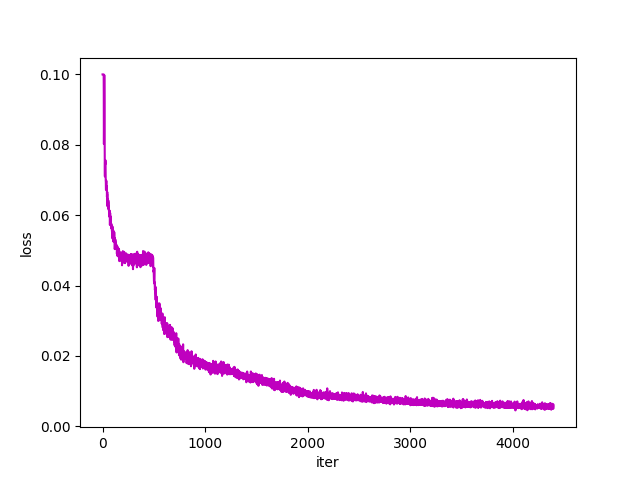
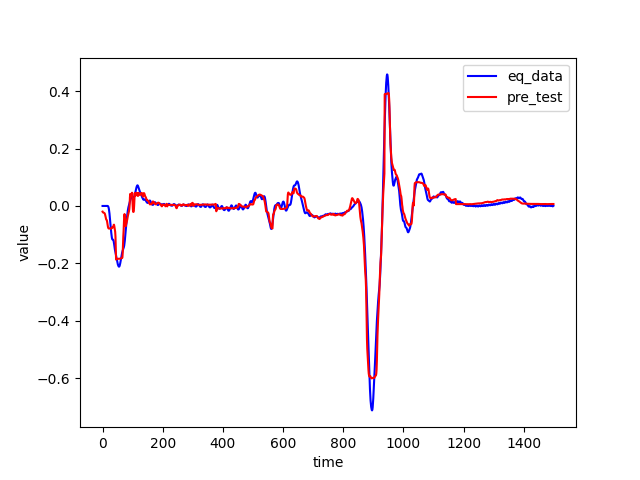

# 基于pure transformer的地震反演

## 1. 模型概述
Pure Transformer 是一种基于自注意力机制（Self-Attention Mechanism）的神经网络架构，最早由 Vaswani et al. 在 2017 年提出。Transformer 通过完全依赖自注意力机制和前馈神经网络，不再需要循环神经网络（RNN）或卷积神经网络（CNN）来处理序列数据。这使得它在处理长序列和并行计算方面具有显著优势。


## 2. 快速开始
使用本模型执行训练的主要流程如下：
1. 基础环境安装：介绍训练前需要完成的基础环境检查和安装。
2. 获取数据集：介绍如何获取训练所需的数据集。
3. 构建环境：介绍如何创建模型训练时所需的环境。
4. 启动训练：介绍如何运行训练。

### 2.1 基础环境安装

请参考[基础环境安装](../../../doc/Environment.md)章节，完成训练前的基础环境检查和安装。

### 2.2 准备数据集
#### 2.2.1 获取数据集

此项目运行的数据集为自有数据集，包含了10组台站点-震源点的对应波形，保存在eq_data/文件夹下。 下载数据集百度网盘链接：https://pan.baidu.com/s/1GhGqAtrzShjqHqkNuQTUDQ 提取码：1122

#### 2.2.2 可视化数据集

eq/data_reprocess.py可以将每个台站点和其对应的震源点的波形可视化。
具体流程：

    1. 数据读取和处理：
    - 代码首先读取了 10 个文件夹中的数据，文件夹名称分别为 value_0 到 value_9。
    - 使用 np.loadtxt 函数读取文件中的数据，并将其分割成 100 个长度为 1500 的片段。
    - 将处理后的数据存储在列表 data 中，最后将其转换为 NumPy 数组 eq_dataset。这个数组的形状最终被转换为 [100, 1500, 10]。
    - 代码再次重复上述步骤，得到ob_dataset，其形状同样为 [100, 1500, 10]。

    2. 数据可视化：
    - 使用 Matplotlib 库绘制第一个样本的数据（即 eq_dataset[0][0] 和 ob_dataset[0][0]）。
    - 将两个数据集分别绘制在同一张图上，使用蓝色和红色进行区分，并添加标签和图例。
    - 显示图表，并将其保存为 plot_0.png。

### 2.3 构建环境

所使用的环境下已经包含PyTorch框架虚拟环境
1. 执行以下命令，启动虚拟环境。
    ```
    conda activate torch_env
    ```
    此环境内已包含所有依赖包，如还需安装可运行。
    ```
    pip install -r requirements.txt
    ```

### 2.4 启动训练
1. 在构建好的环境中，进入训练脚本所在目录。
    ```
    cd PyTorch/contrib/AI4Science/EQ-Transformer
    ```

2. 运行训练。

    -  单机单进程
    ```
    python run_scripts/run_script.py --device sdaa --epochs 400
    ```
    -  单机四进程
    ```
    python run_scripts/run_script.py --ddp --device sdaa --epochs 400 --nproc_per_node 4 --nnodes 1
    ```

    更多训练参数参考[README](run_scripts/README.md)

3. 运行推理。
    ```
    python run_scripts/run_script.py --inference --device sdaa
    ```

    结果存在eq/result_visualize_transf。

### 2.5 训练结果

1. 损失可视化



单进程运行结果：

    100个epoch后的loss为：0.0174
    
    400个epoch后的loss为：0.0056

2. 结果可视化



蓝线：震源的原始波形

红线：通过台站波形预测出来的对应震源波形

结果显示有较相似的波形

