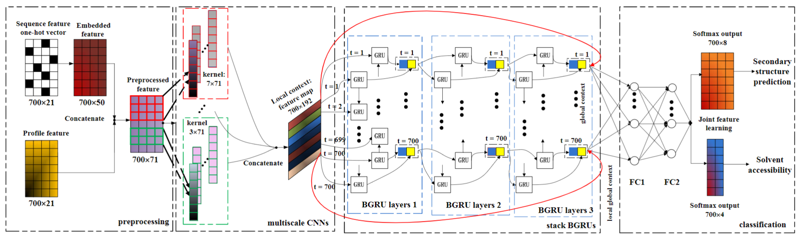

# 基于CNN的蛋白质结构预测

## 1. 模型概述
NN的结构设计主要参考论文[Protein Secondary Structure Prediction Using Cascaded Convolutional and Recurrent Neural Networks](https://arxiv.org/abs/1604.07176)，这是一篇使用深度学习进行蛋白质二级结构预测的经典论文，文中使用了CNN+BiGRU的结构进行蛋白质二级结构预测，模型结构如下：

该模型先通过CNN捕获局部信息，再通过RNN融入全局信息，是NLP长文本任务的常见baseline模型。这里基本照搬了模型结构，但将编码部分改为了word2vec预训练的结构，词向量大小为128，其它结构和参数与原文一致

github参考链接：https://github.com/wudejian789/2020TIANCHI-ProteinSecondaryStructurePrediction-TOP1


## 2. 快速开始
使用本模型执行训练的主要流程如下：
1. 基础环境安装：介绍训练前需要完成的基础环境检查和安装。
2. 获取数据集：介绍如何获取训练所需的数据集。
3. 构建环境：介绍如何使用创建模型训练时所需的环境。
4. 启动训练：介绍如何运行训练。

### 2.1 基础环境安装

请参考[基础环境安装](../../../doc/Environment.md)章节，完成训练前的基础环境检查和安装。

### 2.2 准备数据集
#### 2.2.1 获取数据集

此项目运行的数据集为[天池大赛](https://tianchi.aliyun.com/competition/entrance/231781)提供，下载地址：https://tianchi.aliyun.com/competition/entrance/231781/information。

### 2.2.2 数据集目录
```
└── protein
    ├──data_sec_train.txt
    └──data_seq_train.txt
```
data_sec_train.txt和data_seq_train.txt的格式如下：
```

# data_seq_train.txt中为蛋白质的一级结构，每一个字母代表一个的氨基酸，其中主要包含有20种常见的氨基酸，其样式如下：
GPTGTGESKCPLMVKVLDAVRGSPAINVAVHVFRKAADDTWEPFASGKTSESGELHGLTTEEEFVEGIYKVEIDTKSYWKALGISPFHEHAEVVFTANDSGPRRYTIAALLSPYSYSTTAVVTNPKE

# data_sec_train.txt中为蛋白质的二级结构，它是一条与一级结构长度相等的一维序列，用以表征一级结构种的各位置的氨基酸在三维空间种的形态，例如以上蛋白质一节结构对应的二级结构为：
           EEEEEEETTTTEE TT EEEEEEE TTSSEEEEEEEE  TTSEE  S  TTT  SEEEEEEE HHHHHHTTT   SEEEEEEEEEESTTS  EEEEEEEEETTEEEEEEEEE    
```

### 2.3 构建环境

所使用的环境下已经包含PyTorch框架虚拟环境
1. 执行以下命令，启动虚拟环境。
    ```
    conda activate torch_env_dbz
    ```
    注：numpy必须为numpy==1.22.1
    ```
    pip install -r requirements.txt
    ```

### 2.4 启动训练
1. 在构建好的环境中，进入训练脚本所在目录。
    ```
    cd PyTorch/contrib/AI4Science/protein
    ```

2. 运行训练。

    - 单机单卡
    ```
        python run_scripts/run_script.py --train_size=64 --batch_size=64 --epoch=10 --save_rounds=10 --save_path=model/FinalModel --k_fold=3 --device=sdaa

    ```

    - 单机多卡
    ```
        python run_scripts/run_script.py --ddp --train_size=64 --batch_size=64 --epoch=10 --save_rounds=10 --save_path=model/FinalModel --k_fold=3 --device=sdaa --nproc_per_node 4
    ```

    更多训练参数参考[README](run_scripts/README.md)

### 2.5 训练结果

| |ACC|MaF|Score|
|----|----|----|----|
|CV_1|0.800|0.341|0.391|
|CV_1|0.797|0.331|0.381|
|MEAN|0.799|0.336|0.386|