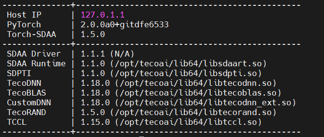

# MobileVit

## 1. 模型概述
MobileVit是一种轻量型的视觉transformer，本项目中的模型应用在UCM数据集上的遥感图像分类任务中。结合CNN和ViT的优势，为移动视觉任务构建一个轻量级、低延迟的网络。

源码链接: https://github.com/WZMIAOMIAO/deep-learning-for-image-processing/tree/master/pytorch_classification/MobileViT

## 2. 快速开始

### 2.1 基础环境安装

请参考[基础环境安装](../../../../doc/Environment.md)章节，完成训练前的基础环境检查和安装。


### 2.2 数据集准备
#### 2.2.1 数据集介绍

UCM遥感数据集是由UC Merced计算机视觉实验室公布的用于遥感图像场景分类的公开数据集，包含21类场景，其中每个类别各包含100张遥感图像，整个数据集一共2100张遥感图像，每张遥感图像的大小为256 × 256。

#### 2.2.2 从百度网盘中下载数据集
链接：https://pan.baidu.com/s/1rqdhZBxQopT3eP1PI7nbrg \
提取码：dawf 

#### 2.2.3 解压数据集

解压训练数据集：

``` bash
unzip UCM.zip
```

#### 2.2.4 数据集目录结构

UCM数据集目录结构参考如下所示:

```
|-UCM
    |-class0
        |-123.jpg
        |-234.jpg
    |-class1
        |-345.jpg
        |-456.jpg
    |-...
```

### 2.3 构建环境
所使用的环境下已经包含PyTorch框架虚拟环境
1. 执行以下命令，启动虚拟环境。
``` bash
cd <ModelZoo_path>/PyTorch/contrib/Classification/MobileVIT

conda activate torch_env

# 执行以下命令验证环境是否正确，正确则会打印如下版本信息
python -c "import torch_sdaa"
```
<p align="center">
    
</p>

2. 安装python依赖
``` bash
# install requirements
pip install -r requirements.txt

# install tcsp_dlloger
git clone https://gitee.com/xiwei777/tcap_dlloger.git
cd tcap_dllogger
python setup.py install
```

### 2.4 启动训练
1. 在构建好的环境中，进入训练脚本所在目录。
    ```
    cd <ModelZoo_path>/PyTorch/contrib/Classification/MobileVIT/run_scripts
    ```


注：在UCM数据集上训练100epoch，3卡DDP，开启amp得pth权重文件。\

2. 运行训练。该模型支持单机单SPA、单机单卡（DDP）。训练过程可选择使用官方的预训练文件mobilevit_xxs.pt进行预训练，下载链接
\
链接：https://pan.baidu.com/s/1gUGivKyt9-2_RRlyQbs5kg \
提取码：moyh 

训练过程保存的best权重会保存在"weights"中,日志会保存在工作目录中。

- 单机单SPA训练
    ```
    python run_scripts/run_MobileVit.py  --epochs 100  --lr 0.01  --batch-size 32  --data ./data/UCM  --num_classes 21  --model-name MobileVit  --distributed False  --use_amp True  --device sdaa  --path ./experiments/
    ```
- 单机单卡训练（DDP）
    ```
    python run_scripts/run_MobileVit.py --nproc_per_node 3 --batch-size 32 --epochs 100 --lr 0.01 --distributed True --num_classes 21 --data-path ./data/UCM --weights '' --model-name MobileVit

    ```

更多训练参数参考[README](run_scripts/README.md)


### 2.5 训练结果

| 芯片 |卡  | 模型 |  混合精度 |Batch size|Shape| 
|:-:|:-:|:-:|:-:|:-:|:-:|
|SDAA|1| MobileViT |是|96|224*224|

**训练结果量化指标如下表所示**

| 训练数据集 | 输入图片大小 | accuracy | accuracy（n卡） |
| :-----: | :-----: | :------: |:------: |
| UCM | 224x224 | 95.0% |95.2% |

**训练过程loss曲线如下图所示**
<p align="center">
    
</p>

**训练过程正确率曲线如下图所示**
<p align="center">
    
</p>


