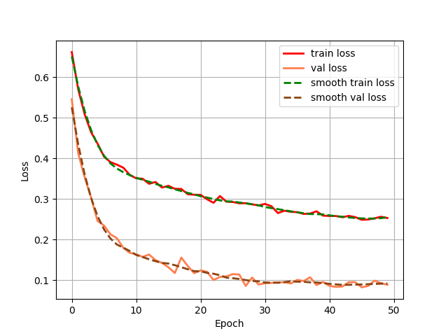

# Siamese：基于孪生神经网络的手写体识别在Pytorch当中的实现

## 1. 模型概述
Siamese网络是一种广泛用于图像识别、比对和相似性测量的深度学习架构。它由两个或多个共享参数的子网络组成，这些子网络通常采用卷积神经网络（CNN）来提取特征。Siamese网络的核心思想是通过比较输入对之间的相似性或距离来判断它们是否属于同一类别或是否相似。其应用领域包括人脸验证、图像去重、手写字符识别以及其它需要比较两个输入数据相似性的任务。Siamese网络的显著优势在于其高效的特征提取和匹配能力，能够在许多实际场景中取得良好的性能。

## 2. 快速开始
使用本模型执行训练的主要流程如下：

1.运行环境配置：介绍训练前需要完成的运行环境配置和检查。

2.数据集准备：介绍如何使用如何获取并处理数据集。

3.启动训练：介绍如何运行训练。

### 2.1 运行环境配置

#### 2.1.1 拉取代码仓

``` bash
git clone https://gitee.com/tecorigin/modelzoo.git
```
#### 2.1.1 创建Teco虚拟环境

``` bash
cd /modelzoo/PyTorch/contrib/Classification/Siamese
conda activate torch_env

# 执行以下命令验证环境是否正确，正确则会打印如下版本信息
python -c "import torch_sdaa"
```
<p align="center">
    
</p>

``` bash
# install requirements
pip install -r requirements.txt

# install tcsp_dllogger
git clone https://gitee.com/xiwei777/tcap_dllogger.git
cd tcap_dllogger
python setup.py install
```


### 2.2 数据集准备
#### 2.2.1 数据集介绍

我们在本项目中使用了 Omniglot 数据集进行训练。Omniglot数据集是一个用于评估机器学习算法在少样本学习（Few-shot Learning）任务中性能的广泛使用的数据集。它由1623个手写字符类别组成，每个类别包含20个不同的样本，这些字符来自50种不同的书写系统，包括许多真实世界的和构造的语言。Omniglot数据集的设计灵感来自人类语言的多样性，旨在测试模型在处理未见过的类别时的泛化能力。由于其复杂性和广泛的类别，Omniglot数据集被广泛应用于研究和开发能够在极少训练样本情况下进行有效学习的算法。


#### 2.2.2 从百度网盘中下载数据集
Omniglot数据集下载地址为：    
链接: https://pan.baidu.com/s/1pYp6vqiLLRFLn1tVeRk8ZQ 提取码: 5sa7  

#### 2.2.3 处理数据集

使用如下格式进行训练
```python
- image_background
	- Alphabet_of_the_Magi
		- character01
			- 0709_01.png
			- 0709_02.png
			- ……
		- character02
		- character03
		- ……
	- Anglo-Saxon_Futhorc
	- ……
```
下载好数据集，解压后放在根目录即可。


### 2.3 启动训练
训练命令：支持单机单SPA以及单机单卡（DDP）。训练过程保存的权重以及日志均会保存在"logs"中。

- 单机单SPA训练
    ```
    python run_scripts/run_siamese_train.py --model_name Siamese --batch_size 32 --lr 1e-2 --device sdaa --epoch 50 --distributed False --use_amp True --train_data_path datasets 
    ```
- 单机单卡训练（DDP）
    ```
    python run_scripts/run_siamese_train.py --model_name Siamese --nproc_per_node 3 --batch_size 32 --lr 1e-2 --device sdaa --epoch 50 --distributed True --use_amp True --train_data_path datasets 
    ```
    训练命令参数说明参考[文档](run_scripts/README.md)。


### 2.4 训练结果

| 芯片 |卡  | 模型 |  混合精度 |Batch size|Shape| 
|:-:|:-:|:-:|:-:|:-:|:-:|
|SDAA|1| Siamese |是|32|105*105|

**训练结果量化指标如下表所示**

| 训练数据集 | backbone |测试数据集 | 输入图片大小 | accuracy |
| :-----: | :-----: | :------: | :------: | :------: |
| Omniglot | vgg16 | Omniglot | 105x105 | 97.2% |

**训练过程loss曲线如下图所示**
<p align="center">
    
</p>


