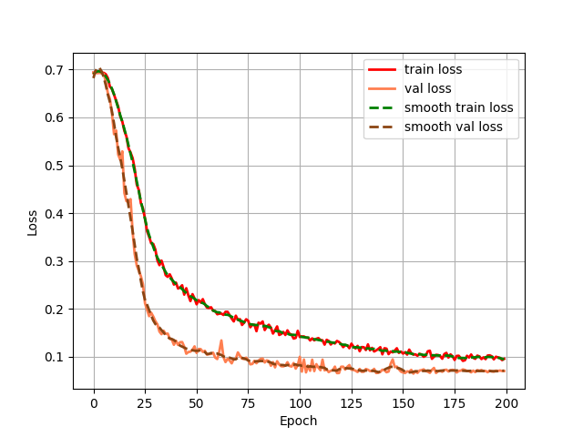

# Swin Transformer Tiny：基于Swin Transformer Tiny的分类模型在Pytorch当中的实现

## 1. 模型概述
Swin Transformer Tiny 是一种高效的视觉模型，利用分层结构和移位窗口注意力机制来处理图像。它通过将图像分割成小块并在不同层次上应用自注意力机制，显著提升了计算效率和性能，是计算资源受限场景中的理想选择。

## 2. 快速开始
使用本模型执行训练的主要流程如下：

1.运行环境配置：介绍训练前需要完成的运行环境配置和检查。

2.数据集准备：介绍如何使用如何获取并处理数据集。

3.启动训练：介绍如何运行训练。

### 2.1 运行环境配置

#### 2.1.1 拉取代码仓

``` bash
git clone https://gitee.com/tecorigin/modelzoo.git
```
#### 2.1.1 创建Teco虚拟环境

``` bash
cd /modelzoo/PyTorch/contrib/Classification/Swin_Transformer_Tiny
conda activate torch_env

# 执行以下命令验证环境是否正确，正确则会打印如下版本信息
python -c "import torch_sdaa"
```
<p align="center">
    
</p>

``` bash
# install requirements
pip install -r requirements.txt

# install tcsp_dllogger
git clone https://gitee.com/xiwei777/tcap_dllogger.git
cd tcap_dllogger
python setup.py install
```


### 2.2 数据集准备

#### 2.2.1 从百度网盘中下载数据集

训练所用的示例猫狗数据集可以在百度云下载。   
链接: https://pan.baidu.com/s/1hYBNG0TnGIeWw1-SwkzqpA     
提取码: ass8    

#### 2.2.2 处理数据集

1. 下载好数据集，将训练用的猫狗分类数据集解压后放在根目录。
``` bash
unzip datasets.zip
```
文件格式如下：
```
|-datasets
    |-train
        |-cat
            |-123.jpg
            |-234.jpg
        |-dog
            |-345.jpg
            |-456.jpg
        |-...
    |-test
        |-cat
            |-567.jpg
            |-678.jpg
        |-dog
            |-789.jpg
            |-890.jpg
        |-...
```
2. 在准备好数据集后，需要在根目录运行txt_annotation.py生成训练所需的cls_train.txt。  
``` bash
python txt_annotation.py
```


### 2.3 启动训练
训练命令：支持单机单SPA以及单机单卡（DDP）。训练过程保存的权重以及日志均会保存在"logs"中。

- 单机单SPA训练
    ```
    python run_scripts/run_vgg_train.py --model_name vgg --batch_size 32 --lr 1e-2 --device sdaa --epoch 200 --distributed False --use_amp True --train_annotation_path cls_train.txt --val_pairs_path cls_test.txt
    ```
- 单机单卡训练（DDP）
    ```
    python run_scripts/run_vgg_train.py --model_name vgg --nproc_per_node 3 --batch_size 32 --lr 1e-2 --device sdaa --epoch 200 --distributed True --use_amp True --train_annotation_path cls_train.txt --val_pairs_path cls_test.txt
    ```
    训练命令参数说明参考[文档](run_scripts/README.md)。


### 2.4 训练结果

| 芯片 |卡  | 模型 |  混合精度 |Batch size|Shape| 
|:-:|:-:|:-:|:-:|:-:|:-:|
|SDAA|1| Swin Transformer Tiny |是|32|224*224|

**训练结果量化指标如下表所示**

| 训练数据集 | 基础模型 |  输入图片大小 | accuracy |
| :-----: | :-----: |  :------: | :------: | 
| 猫狗分类数据集 | Swin Transformer Tiny |  224x224 | 97.6% |


**Swin Transformer Tiny训练过程loss曲线如下图所示**
<p align="center">
    
</p>


