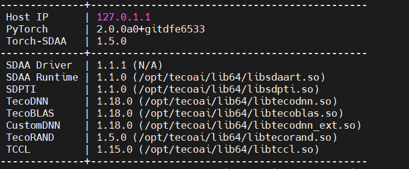
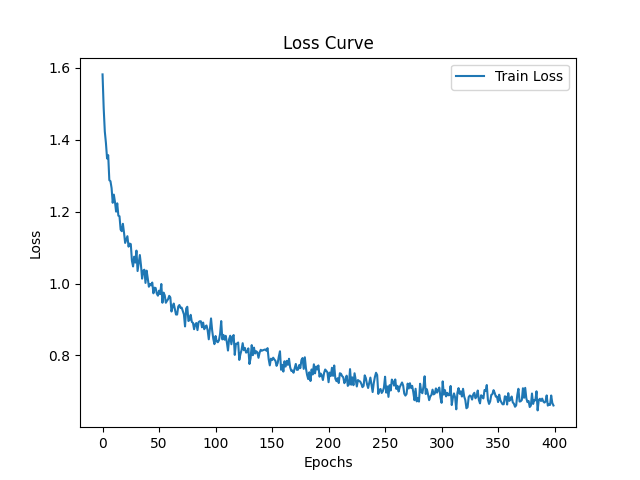
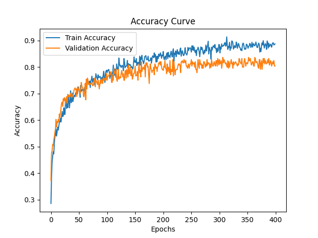

# DENSENET

## 1. 模型概述
DENSENET是一种深度卷积神经网络，通过在网络中引入密集连接（dense connection）来增强特征重用和梯度流动，从而提高模型的性能和泛化能力。

源码链接: https://github.com/WZMIAOMIAO/deep-learning-for-image-processing/tree/master/pytorch_classification/Test8_densenet

## 2. 快速开始

### 2.1 基础环境安装

请参考[基础环境安装](../../../../doc/Environment.md)章节，完成训练前的基础环境检查和安装。


### 2.2 数据集准备
#### 2.2.1 数据集介绍

flower_photos数据集是一个包含多种花卉图片的数据集，用于图像分类任务。该数据集由5个不同的子文件夹组成，每个子文件夹代表一种花的类别，具体包括：1

daisy雏菊：633张图片
dandelion蒲公英：898张图片
roses玫瑰：641张图片
sunflowers向日葵：699张图片
tulips郁金香：799张图片
| 类别名（英文）           | 类别名（中文） |
| ------------------------- | -------------- | 
| daisy       | 雏菊     |
| dandelion   | 蒲公英    |
| roses       | 玫瑰          |
| sunflowers  | 向日葵       | 
| tulips      | 郁金香           |


平均而言，每种花都有大约734张图片。

#### 2.2.2 从百度网盘中下载数据集
链接：https://pan.baidu.com/s/1AVHdwYFwxzI3gTCwFTFKtg \
提取码：kkpb

#### 2.2.3 解压数据集

解压训练数据集：

``` bash
tar -zxvf flower_photos.tgz
```

#### 2.2.4 数据集目录结构

UCM数据集目录结构参考如下所示:

```
|-flower_photos
    |-class0
        |-123.jpg
        |-234.jpg
    |-class1
        |-345.jpg
        |-456.jpg
    |-...
```

### 2.3 构建环境
所使用的环境下已经包含PyTorch框架虚拟环境
1. 执行以下命令，启动虚拟环境。
``` bash
cd <ModelZoo_path>/PyTorch/contrib/Classification/densenet

conda activate torch_env

# 执行以下命令验证环境是否正确，正确则会打印如下版本信息
python -c "import torch_sdaa"
```
<p align="center">
    
</p>

2. 安装python依赖
``` 
bash
# install requirements
pip install -r requirements.txt
```

### 2.4 启动训练
1. 在构建好的环境中，进入训练脚本所在目录。
    ```
    cd <ModelZoo_path>/PyTorch/contrib/Classification/densenet/run_scripts
    ```


注：在flower_photos数据集上训练100epoch，3卡DDP，开启amp得pth权重文件。


训练过程保存的best权重会保存在"weights"中,日志会保存在工作目录中。

- 单机单SPA训练
    ```
    python run_scripts/run_densenet.py  --epochs 100  --lr 0.0005  --batch-size 32  --num_classes 5 --data-path ./data/flower_photos  --model-name densenet  --distributed False  --use_amp True  --device sdaa  --path ./experiments/
    ```
- 单机单卡训练（DDP）
    ```
    python run_scripts/run_densenet.py --nproc_per_node 3 --batch-size 32 --epochs 400 --distributed True --num_classes 5 --data-path ./data/flower_photos --weights '' --model-name densenet --lr 0.0005


    ```

更多训练参数参考[README](run_scripts/README.md)


### 2.5 训练结果

| 芯片 |卡  | 模型 |  混合精度 |Batch size|Shape| 
|:-:|:-:|:-:|:-:|:-:|:-:|
|SDAA|1| MobileViT |是|96|224*224|

**训练结果量化指标如下表所示**

| 训练数据集 | 输入图片大小 | accuracy | accuracy（n卡） |
| :-----: | :-----: | :------: |:------: |
| flower_photos | 224x224 | 85.0% |84.2% |

**训练过程loss曲线如下图所示**
<p align="center">
    
</p>

**训练过程正确率曲线如下图所示**
<p align="center">
    
</p>


