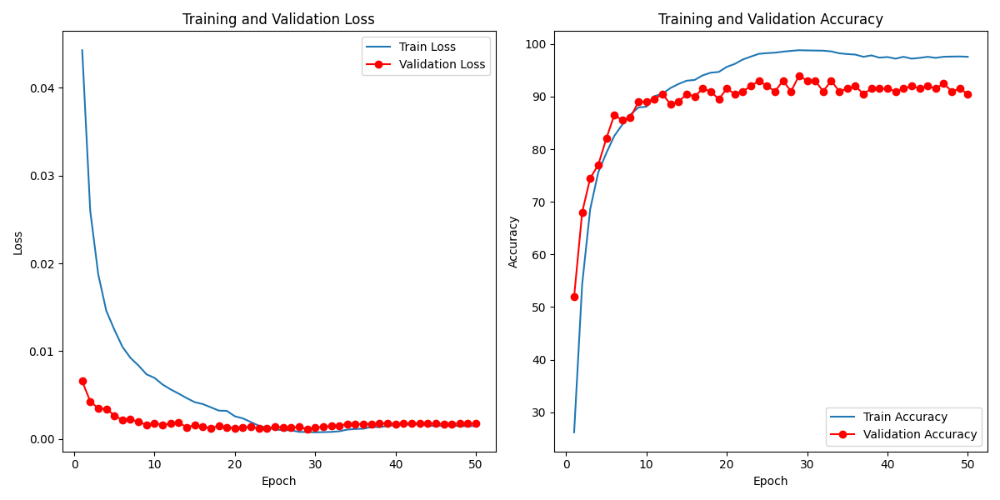

#  MobileNet
本次代提交commit id链接： 820e324
## 1. 模型概述

MobileNet是一种轻量级卷积神经网络模型，专为移动和嵌入式设备上的高效深度学习任务设计。其主要目标是通过减少计算量和模型大小，使得深度学习模型能够在资源受限的设备上运行，同时仍然保持较高的精度。MobileNet通过引入深度可分离卷积（Depthwise Separable Convolutions）来实现高效计算。深度可分离卷积将标准卷积分解为深度卷积和逐点卷积（Pointwise Convolutions），极大地减少了计算量和参数数量。与传统的卷积神经网络相比，MobileNet在计算复杂度和模型大小上有显著的优势。由于其高效性和轻量级特性，MobileNet被广泛应用于各种计算机视觉任务，如图像分类、目标检测、人脸识别和图像分割等。

##  2. 快速开始

使用本模型执行训练的主要流程如下：

1. 基础环境安装：介绍训练前需要完成的基础环境检查和安装。
2. 获取数据集：介绍如何获取训练所需的数据集。
3. 构建环境：介绍如何构建模型运行所需要的环境
4. 启动训练：介绍如何运行训练。

### 2.1 基础环境安装

请参考[基础环境安装](https://gitee.com/tecorigin/modelzoo/blob/main/doc/Environment.md)章节，完成训练前的基础环境检查和安装。

### 2.2 准备数据集

由于所使用的数据集是cifar-10数据集，数据集下载脚本已经内置于运行脚本中，数据集的下载目录默认为../data。

###  2.3 构建环境

1. 执行以下命令，启动虚拟环境。

   ```
   conda activate torch_env
   ```

2. 所需安装的包

   ```
   pip install -r requirements.txt
   ```

###  2.4 启动训练

1.  在构建好的环境中，进入训练脚本所在目录。 

```
cd <ModelZoo_path>/PyTorch/contrib/Classification/mobilenet
```

2. 运行训练。 

* 单机单卡单SPA 

```
python run_scripts/run_mobilenet.py --model_name mobilenet --batch-size 48 --lr 0.01 --device sdaa  --epochs 50 --dataset cifar10  --grad_scale True --autocast True
```

* 单机单卡三SPA 

```
python run_scripts/run_mobilenet.py --model_name mobilenet --batch-size 48 --lr 0.01 --nproc_per_node 3 --master_port 29521 --dataset cifar10 --grad_scale True --autocast True
```

 更多训练参数参考[README](./run_scripts/README.md) 

###  2.5 训练结果

 **训练loss与精确度曲线:** 



 **指标结果：** 

| 模型      | 混合精度 | 数据集   | batch-size | epochs | 精确度 | 耗时 |
| --------- | -------- | -------- | ---------- | ------ | ------ | ---- |
| MobileNet | AMP      | cifar-10 | 48         | 50     | 89.21  | 3h   |

