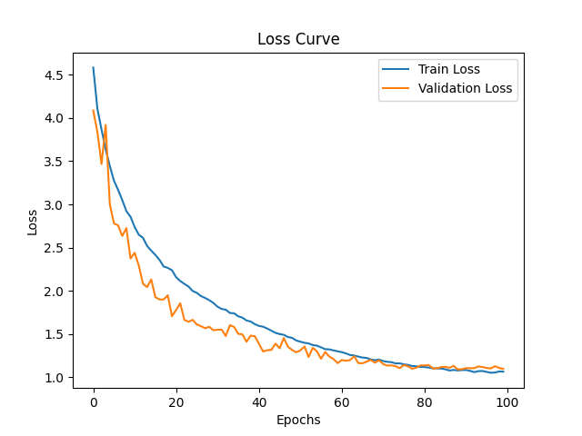
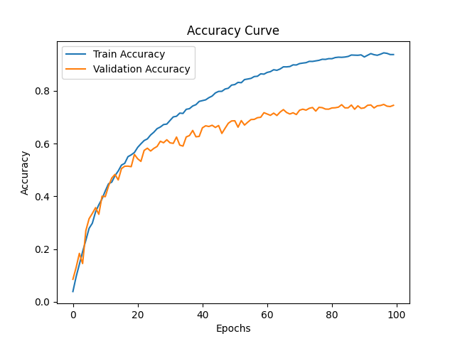

# SeNet

## 1. 模型概述
SeNet希望显式地建模特征通道之间的相互依赖关系。另外，作者并未引入新的空间维度来进行特征通道间的融合，而是采用了一种全新的「特征重标定」策略。

源码链接: https://github.com/miraclewkf/SENet-PyTorch/blob/master/se_resnet.py

## 2. 快速开始

### 2.1 基础环境安装

请参考[基础环境安装](../../../../doc/Environment.md)章节，完成训练前的基础环境检查和安装。


### 2.2 数据集准备

#### 2.2.1 数据集位置
/mnt/nvme/common/train_dataset/mini-imagenet

#### 2.2.2 数据集目录结构

mini_imagenet数据集目录结构参考如下所示:

```
|-mini-imagenet
    |-images
        |-n1313361300001299.jpg
        |-n1313361300001297.jpg
        |-...
    |-train_list.txt
    |-val_list.txt
```

### 2.3 构建环境
所使用的环境下已经包含PyTorch框架虚拟环境
1. 执行以下命令，启动虚拟环境。
``` bash
cd <ModelZoo_path>/PyTorch/contrib/Classification/senet

conda activate torch_env

# 执行以下命令验证环境是否正确，正确则会打印如下版本信息
python -c "import torch_sdaa"
```
<p align="center">
    
</p>

2. 安装python依赖
``` 
bash
# install requirements
pip install -r requirements.txt
```
### 2.4 启动训练
1. 在构建好的环境中，进入训练脚本所在目录。
    ```
    cd <ModelZoo_path>/PyTorch/contrib/Classification/senet
    ```
训练过程保存的best权重会保存在"weights"中,日志会保存在工作目录中。

- 单机单SPA训练
    ```
    python run_scripts/run_senet.py --batch_size 64 --epochs 100 --distributed False --num_classes 100 --lr 0.1 --autocast True --dataset_path /mnt/nvme/common/train_dataset/mini-imagenet
    ```
- 单机单卡训练（DDP）
    ```
    python run_scripts/run_senet.py --nproc_per_node 4 --batch_size 64 --epochs 100 --distributed True --num_classes 100  --dataset_path /mnt/nvme/common/train_dataset/mini-imagenet --lr 0.1 --autocast True
    ```

更多训练参数参考[README](run_scripts/README.md)


### 2.5 训练结果

| 芯片 |卡  | 模型 |  混合精度 |Batch size|Shape| 
|:-:|:-:|:-:|:-:|:-:|:-:|
|SDAA|1| senet |是|64|224*224|

**训练结果量化指标如下表所示**

| 训练数据集 | 输入图片大小 |nproc_per_node| accuracy |
| :-----: | :-----: |:------: |:------: |
| mini_imagenet | 224x224 |4|75.1% |

**训练过程loss曲线如下图所示**
<p align="center">
    
</p>

**训练过程正确率曲线如下图所示**
<p align="center">
    
</p>


