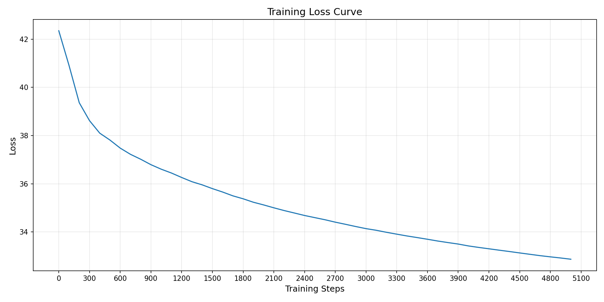

# RT-DETR

## 1. 模型概述

**RT-DETR (Real-Time Detection Transformer)**  是一种实时端到端目标检测器，旨在通过高效的混合编码器设计和IoU感知的查询选择机制，实现高精度和实时性的平衡。在COCO val2017数据集上，RT-DETR-R50模型达到了53.1%的平均精度（AP）和每秒108帧（FPS）的推理速度，RT-DETR-R101模型则实现了54.3%的AP和每秒74帧的速度，均优于同等规模的YOLO系列检测器。

> 本项目基于 [lyuwenyu/RT-DETR](https://github.com/lyuwenyu/RT-DETR)，参考 commit ID: [`df74223`](https://github.com/lyuwenyu/RT-DETR/commit/df742232c6e046e763e57573a78039828f19fb6b)

---

## 2. 快速开始
以下说明旨在帮助您快速搭建并运行 RT-DETR 模型进行训练。整体流程如下所示：
1. [基础环境安装](#21-基础环境安装)：介绍训练前需要完成的基础环境检查和安装。
2. [获取并准备数据集](#22-准备数据集)：介绍如何获取训练所需的数据集。
3. [构建运行环境](#23-构建环境)：介绍如何构建模型运行所需要的环境
4. [启动训练](#24-启动训练)：介绍如何运行训练。

### 2.1 基础环境安装
请参考[基础环境安装](../../../../doc/Environment.md)章节，完成训练前的基础环境检查和安装。  

### 2.2 准备数据集
#### 2.2.1 获取数据集
RT-DETR 采用 **COCO2017** 作为训练和评估数据集。通常做法如下：
- 从 [飞桨 AI Studio](https://aistudio.baidu.com/datasetdetail/97273) 下载 **COCO 2017** 的 `train2017`、`val2017` 以及 `annotations` 数据。
- 解压后应包含 `train2017`、`val2017` 和 `annotations` 三个文件夹。
- 数据集结构示例：

    ```text
    coco
    ├── annotations        # 标注文件（JSON格式）
    ├── train2017          # 训练集图像
    └── val2017            # 验证集图像
    ```

#### 2.2.2 处理数据集
- 确保将解压后的 COCO2017 数据集放置在 `/data/datasets/RT-DETR/coco` 目录下
- 最终数据集路径示例：
   ```text
   /data/datasets
   └── RT-DETR
       └── coco
           ├── annotations
           ├── train2017
           └── val2017
   ```

### 2.3 构建环境
所使用的环境下已经包含 PyTorch 框架虚拟环境。

1. **执行以下命令，启动虚拟环境**：
    ```bash
    conda activate torch_env
    ```

2. **安装 Python 依赖**  
   在启动虚拟环境后，执行以下命令安装项目所需的依赖：
   ```bash
   pip install -r requirements.txt
   ```

3. **安装指定版本的 torchvision**  
   为了解决 [Issue #68](https://github.com/lyuwenyu/RT-DETR/issues/68)，需安装 `torchvision==0.15.2` 

   ```bash
   pip install torchvision==0.15.2 --no-deps
   ```

### 2.4 启动训练
1. **在构建好的环境中，进入训练脚本所在目录**：
    ```bash
    cd "<ModelZoo_path>/PyTorch/contrib/Detection/RT-DETR/scripts"
    ```

2. **开始训练**

   **方法一：使用 Shell 脚本启动（默认单机单卡）**
   ```bash
   bash train_sdaa_3rd.sh
   ```
   
   **方法二：使用 `torchrun` 命令启动**  
   单机单核组：
   ```bash
   torchrun --standalone --nnodes=1 --nproc_per_node=1 ../tools/train.py -c ../configs/rtdetr/rtdetr_r50vd_6x_coco.yml
   ```
   单机单卡：
   ```bash
   torchrun --standalone --nnodes=1 --nproc_per_node=4 ../tools/train.py -c ../configs/rtdetr/rtdetr_r50vd_6x_coco.yml
   ```

### 2.5 训练结果

#### 2.5.1 训练配置：
使用 `train_sdaa_3rd.sh` 训练了 5000 步
#### 2.5.2 日志概览：  
   - 初始 loss 在 `42.35` 左右，随着迭代逐渐下降；  
   - 迭代到 5000 步(共 7393 步)时，loss 降至约 `32.87` 附近；  
   - 单个迭代（iteration）耗时大约在 `7.7s ~ 11.6s` 左右（不同阶段略有波动），整个 epoch 预计 **十余小时** 完成。  

#### 2.5.3 最终指标(一个 Epoch 未结束，供参考)： 
   - **最终训练 loss：** 约 `32.87` (根据收敛趋势推断，或更低)  
   - **训练总时长：** 约 **14 小时** 
   - 由于只进行了 **不到 1 个 Epoch** 的预训练，整体 loss  尚未达到完全收敛，只能作为一个简单的演示结果或快速验证。 

示例训练的 loss 曲线如下（示例图）:


- **初始 loss**: 42.3491  
- **最终 loss**: 32.8679