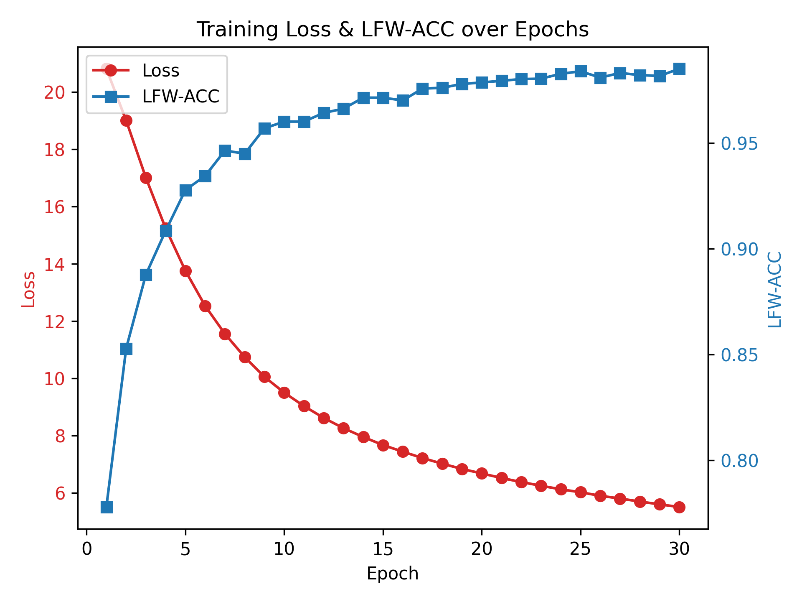

# CosFace

## 1. 模型概述

**CosFace**  属于深度学习中的人脸识别算法，主要目的是优化特征学习的判别能力。它通过在传统的 Softmax 损失函数中引入余弦边界 margin，使得同一类别的特征更加紧密，不同类别的特征更加分离，从而提高人脸识别的准确性。CosFace 通过 L2 归一化特征向量和权重向量，并在余弦相似度上引入一个固定的 margin，从而增强类间区分度，同时减少类内方差。这种方式有效解决了传统 Softmax 在判别能力上的不足，使得模型在各种人脸识别任务（如人脸验证、人脸识别等）中获得更好的泛化性能。

> 本项目基于 [MuggleWang/CosFace_pytorch](https://github.com/MuggleWang/CosFace_pytorch)，参考 commit ID: [`81de0a9`](https://github.com/MuggleWang/CosFace_pytorch/commit/81de0a95b99661b12441e7c6f846082ac08ce054)

---

## 2. 快速开始
以下说明旨在帮助您快速搭建并运行 CosFace 模型进行训练。整体流程如下所示：
1. [基础环境安装](#21-基础环境安装)：介绍训练前需要完成的基础环境检查和安装。
2. [获取并准备数据集](#22-准备数据集)：介绍如何获取训练所需的数据集，并对其进行预处理。
3. [启动训练](#23-启动训练)：介绍如何运行训练。

### 2.1 基础环境安装
请参考[基础环境安装](../../../../doc/Environment.md)章节，完成训练前的基础环境检查和安装。  

### 2.2 准备数据集

#### 2.2.1 获取数据集

CosFace 训练通常使用 **CASIA-WebFace** 进行训练，并以 **LFW** 数据集进行评估验证。  
- **CASIA-WebFace**：由清华大学发布，包含 494,414 张人脸图像，覆盖 10,575 人。  
- **LFW (Labeled Faces in the Wild)**：常见的人脸验证测试集，包含 13,233 张人脸图像。  

获取方式：  
1. 访问 [CASIA-WebFace 下载页面](https://aistudio.baidu.com/datasetdetail/121772)，将文件下载并解压。  
2. 访问 [LFW 下载页面](https://aistudio.baidu.com/datasetdetail/314724)，将文件下载并解压。

#### 2.2.2 组织数据集

1. **CASIA-WebFace 目录结构**  
   下载并解压后，通常包含若干以个人 ID 或姓名命名的子文件夹，每个子文件夹对应多张人脸照片。例如：

   ```text
   CASIA-WebFace
   ├── 0000047
   │   ├── 001.jpg
   │   └── 002.jpg
   ├── 0000167
   │   ├── 001.jpg
   │   └── 002.jpg
   └── ...
   ```

2. **LFW 目录结构**  
   下载并解压后，同样包含多个文件夹，每个文件夹内是对应人物的人脸图像：

   ```text
   lfw
   ├── Aaron_Eckhart
   │   ├── Aaron_Eckhart_0001.jpg
   │   └── ...
   ├── Abba_Eban
   │   ├── Abba_Eban_0001.jpg
   │   └── ...
   └── ...
   ```

3. **数据放置位置**  
   确保 `CASIA-WebFace` 和 `lfw` 目录正确存放在 `/data/datasets/CosFace/data` 目录下，以匹配默认的数据处理脚本路径：  
   ```text
   /data/datasets/CosFace/data
   ├── CASIA-WebFace
   │   ├── 0000047
   │   ├── 0000167
   │   └── ...
   └── lfw
       ├── Aaron_Eckhart
       ├── Abba_Eban
       └── ...
   ```

#### 2.2.3 运行数据处理脚本

1. **执行以下命令，启动虚拟环境**：
    ```bash
    conda activate torch_env
    ```
2. **安装依赖**  
   在虚拟环境中，执行以下命令安装项目所需的依赖：
   ```bash
   pip install -r requirements.txt
   ```
3. **进入数据处理脚本所在目录**：
    ```bash
    cd "<ModelZoo_path>/PyTorch/contrib/Face/CosFace/scripts"
    ```
4. **运行数据处理脚本**
   ```bash
   bash process_data.sh
   ```

#### **2.2.4 数据处理完成后检查**
数据预处理完成后，请确保目标文件结构正确，以便后续训练流程能够顺利进行。以下是正确的文件和目录结构：
```text
/data/datasets/CosFace
├── data                # 原始数据集
│   ├── CASIA-WebFace
│   └── lfw
├── result              # 预处理后的数据（已对齐、裁剪）
│   ├── CASIA-WebFace-112X96   # 训练数据
│   └── lfw-112X96             # 验证数据
└── CASIA-WebFace-112X96.txt   # 记录预处理后的训练数据的文件列表
```

### 2.3 启动训练

- 方法一：使用 Shell 脚本启动（默认单机单卡）
   ```bash
   bash train_sdaa_3rd.sh
   ```
   
- 方法二：使用 `torchrun` 命令启动

   单机单核组：
   ```bash
   torchrun --standalone --nnodes=1 --nproc_per_node=1 ../main.py
   ```
   单机单卡：
   ```bash
   torchrun --standalone --nnodes=1 --nproc_per_node=4 ../main.py
   ```

#### 更多训练参数
请参考脚本目录下的 [README](./scripts/README.md) 获取更多参数说明。

### 2.4 训练结果

#### 2.4.1 训练配置：
使用 `train_sdaa_3rd.sh` 训练了 30 个 Epoch

#### 2.4.2 最终指标（ 30 个 Epoch 结束后，供参考）： 

| 模型              | 数据集             | LFW-ACC | 训练耗时   |
|-------------------|--------------------|---------|--------|
| Sphere20 (CosFace)| CASIA-WebFace/LFW | 98.52%  | ~2h20m |


示例训练的 Loss 和 LFW-ACC 曲线如下:


- **初始 loss**: 20.7833
- **最终 loss**: 5.5254 
