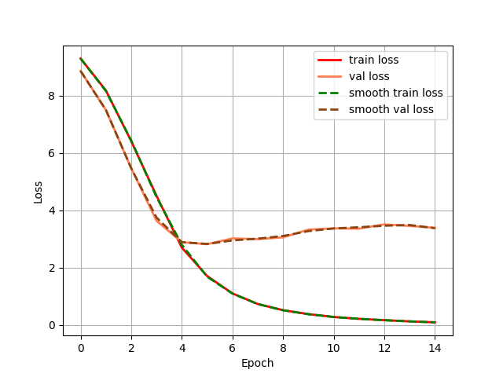
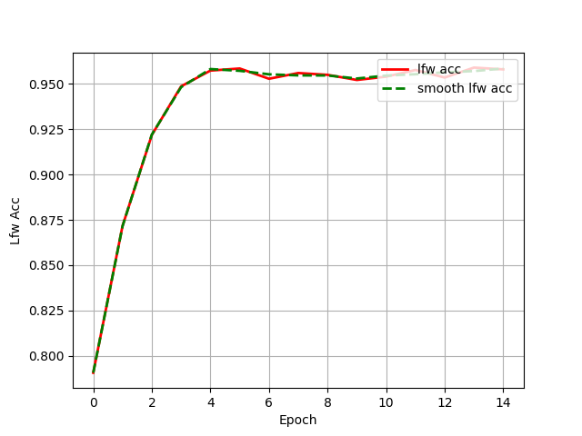

# Facenet：人脸识别模型在Pytorch当中的实现

## 1. 模型概述
FaceNet是谷歌研究团队提出的一种深度学习模型，主要用于面部识别和验证任务。通过深度卷积神经网络，FaceNet将人脸图像映射到一个128维的欧几里得空间中，使得同一人的面部图像在嵌入空间中的距离较近，而不同人的面部图像距离较远。其核心技术是三重损失函数（Triplet Loss），通过优化三元组（Anchor, Positive, Negative）之间的距离关系来训练模型。

## 2. 快速开始
使用本模型执行训练的主要流程如下：

1.运行环境配置：介绍训练前需要完成的运行环境配置和检查。

2.数据集准备：介绍如何使用如何获取并处理数据集。

3.启动训练：介绍如何运行训练。

### 2.1 运行环境配置

#### 2.1.1 拉取代码仓

``` bash
git clone https://gitee.com/tecorigin/modelzoo.git
```
#### 2.1.1 创建Teco虚拟环境

``` bash
cd /modelzoo/PyTorch/contrib/Face/Facenet
conda activate torch_env

# 执行以下命令验证环境是否正确，正确则会打印如下版本信息
python -c "import torch_sdaa"
```
<p align="center">
    
</p>

``` bash
# install requirements
pip install -r requirements.txt

# install tcsp_dllogger
git clone https://gitee.com/xiwei777/tcap_dllogger.git
cd tcap_dllogger
python setup.py install
```


### 2.2 数据集准备
#### 2.2.1 数据集介绍

我们在本项目中使用了 CASIA-WebFace 数据集进行训练。CASIA-WebFace 数据集由中国科学院自动化研究所（CASIA）创建。该数据集包含了大量的人脸图像，以及对应的身份标签。该数据集共包含 494,414 张人脸图像，来自 10,575 个不同的身份。
我们在本项目中使用了 LFW (Labled Faces in the Wild) 数据集进行测试。LFW数据集是目前人脸识别的常用测试集，其中提供的人脸图片均来源于生活中的自然场景。LFW数据集共有13233张人脸图像，每张图像均给出对应的人名，共有5749人，且绝大部分人仅有一张图片。


#### 2.2.2 从百度网盘中下载数据集
训练用的CASIA-WebFaces数据集以及评估用的LFW数据集可以在百度网盘下载。    
链接: https://pan.baidu.com/s/1qMxFR8H_ih0xmY-rKgRejw 提取码: bcrq   

#### 2.2.3 处理数据集

使用如下格式进行训练
```
|-datasets
    |-people0
        |-123.jpg
        |-234.jpg
    |-people1
        |-345.jpg
        |-456.jpg
    |-...
```  
下载好数据集，将训练用的CASIA-WebFaces数据集以及评估用的LFW数据集，解压后放在根目录。
``` bash
unzip datasets.zip
unzip lfw.zip
```
在训练前利用txt_annotation.py文件生成对应的cls_train.txt。
``` bash
python txt_annotation.py
```


### 2.3 启动训练
训练命令：支持单机单SPA以及单机单卡（DDP）。训练过程保存的权重以及日志均会保存在"logs"中。

- 单机单SPA训练
    ```
    python run_scripts/run_facenet_train.py --model_name facenet --batch_size 30 --lr 3e-5 --device sdaa --epoch 14 --distributed False --use_amp True --train_data_path datasets --train_annotation_path cls_train.txt --val_data_path lfw --val_pairs_path model_data/lfw_pair.txt
    ```
- 单机单卡训练（DDP）
    ```
    python run_scripts/run_facenet_train.py --model_name facenet --nproc_per_node 3 --batch_size 96 --lr 1e-3 --device sdaa --epoch 14 --distributed True --use_amp True --train_data_path datasets --train_annotation_path cls_train.txt --val_data_path lfw --val_pairs_path model_data/lfw_pair.txt
    ```
    训练命令参数说明参考[文档](run_scripts/README.md)。


> **说明：**
   > 在训练的过程中就使用LFW数据集进行测试，因此此处不提供额外的测试代码。


### 2.4 训练结果

| 芯片 |卡  | 模型 |  混合精度 |Batch size|Shape| 
|:-:|:-:|:-:|:-:|:-:|:-:|
|SDAA|1| facenet |是|96|160*160|

**训练结果量化指标如下表所示**

| 训练数据集 | backbone |权值文件名称 | 测试数据集 | 输入图片大小 | accuracy |
| :-----: | :-----: | :------: | :------: | :------: | :------: |
| CASIA-WebFace | inception_resnetv1 | [facenet_inception_resnetv1.pth](https://github.com/bubbliiiing/facenet-pytorch/releases/download/v1.0/facenet_inception_resnetv1.pth) | LFW | 160x160 | 96.28% |

**训练过程loss曲线如下图所示**
<p align="center">
    
</p>

**训练过程正确率曲线如下图所示**
<p align="center">
    
</p>


