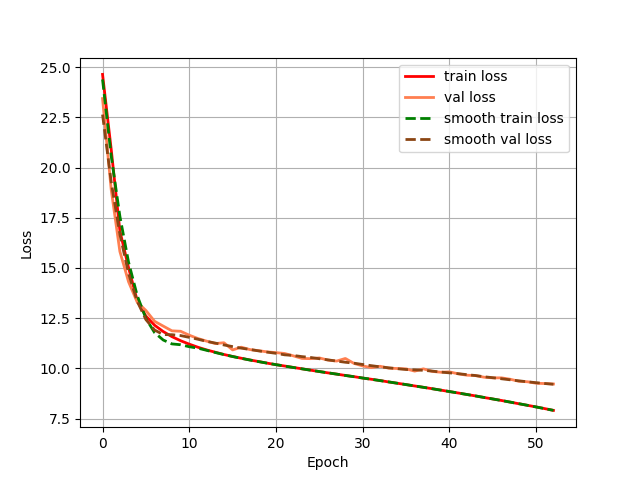
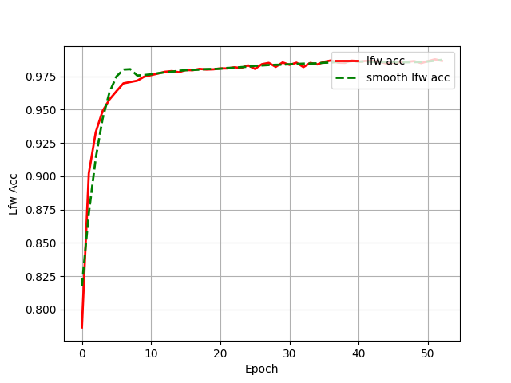

# arcface：人脸识别模型arcface在Pytorch当中的实现

## 1. 模型概述
arcface是一种先进的面部识别算法，通过引入加性角度间隔损失（AAM Loss），在特征向量之间引入角度间隔，增强了同类样本的紧密性和异类样本的分离性。该方法显著提升了面部识别的准确性和鲁棒性，在多个基准测试和实际应用中表现出色，被广泛用于身份验证、安防监控等领域。

## 2. 快速开始
使用本模型执行训练的主要流程如下：
1. 基础环境安装：介绍训练前需要完成的基础环境检查和安装。
2. 获取数据集：介绍如何获取训练所需的数据集。
3. 训练环境搭建：介绍如何创建模型训练时所需的Docker环境。
4. 启动训练：介绍如何运行训练。


### 2.1 基础环境安装

请参考[基础环境安装](../../../doc/Environment.md)章节，完成训练前的基础环境检查和安装。

### 2.2 准备数据集
#### 2.2.1 数据集介绍

我们在本项目中使用了 CASIA-WebFace 数据集进行训练。CASIA-WebFace 数据集由中国科学院自动化研究所（CASIA）创建。该数据集包含了大量的人脸图像，以及对应的身份标签。该数据集共包含 494,414 张人脸图像，来自 10,575 个不同的身份。
我们在本项目中使用了 LFW (Labled Faces in the Wild) 数据集进行测试。LFW数据集是目前人脸识别的常用测试集，其中提供的人脸图片均来源于生活中的自然场景。LFW数据集共有13233张人脸图像，每张图像均给出对应的人名，共有5749人，且绝大部分人仅有一张图片。


#### 2.2.2 从百度网盘中下载数据集
训练用的CASIA-WebFaces数据集以及评估用的LFW数据集可以在百度网盘下载。    
链接: https://pan.baidu.com/s/1qMxFR8H_ih0xmY-rKgRejw 提取码: bcrq   

#### 2.2.3 处理数据集

使用如下格式进行训练
```
|-datasets
    |-people0
        |-123.jpg
        |-234.jpg
    |-people1
        |-345.jpg
        |-456.jpg
    |-...
```  
下载好数据集，将训练用的CASIA-WebFaces数据集以及评估用的LFW数据集，解压后放在根目录。
``` bash
unzip datasets.zip
unzip lfw.zip
```
在训练前利用txt_annotation.py文件生成对应的cls_train.txt。
``` bash
python txt_annotation.py
```

### 2.3 训练环境搭建

#### 2.3.1 拉取代码仓

``` bash
git clone https://gitee.com/tecorigin/modelzoo.git
```
#### 2.3.2 创建Teco虚拟环境

``` bash
cd /modelzoo/PyTorch/contrib/Face/arcface
conda activate torch_env

# 执行以下命令验证环境是否正确，正确则会打印如下版本信息
python -c "import torch_sdaa"
```
<p align="center">
    
</p>

``` bash
# install requirements
pip install -r requirements.txt

# install tcsp_dllogger
git clone https://gitee.com/xiwei777/tcap_dllogger.git
cd tcap_dllogger
python setup.py install
```


### 2.4 启动训练
1. 在Docker环境中，进入训练脚本所在目录。
    ``` bash
    cd /modelzoo/PyTorch/contrib/Face/arcface
    ```

2. 运行训练。该模型支持单机单SPA以及单机单卡（DDP）。训练过程保存的权重以及日志均会保存在"logs"中。

- 单机单SPA训练
    ```
    python run_scripts/run_facenet_train.py --model_name arcface --batch_size 30 --lr 1e-2 --device sdaa --epoch 50 --distributed False --use_amp True --train_data_path datasets --train_annotation_path cls_train.txt --val_data_path lfw --val_pairs_path model_data/lfw_pair.txt
    ```
- 单机单卡训练（DDP）
    ```
    python run_scripts/run_facenet_train.py --model_name arcface --nproc_per_node 3 --batch_size 96 --lr 1e-2 --device sdaa --epoch 50 --distributed True --use_amp True --train_data_path datasets --train_annotation_path cls_train.txt --val_data_path lfw --val_pairs_path model_data/lfw_pair.txt
    ```

参数名 | 解释 | 样例
-----------------|-----------------|-----------------
model_name | 模型名称 | --model_name arcface
distributed | 是否开启DDP| --distributed True
nproc_per_node | 每个节点上的进程数| --nproc_per_node 3
nnodes | 多机节点数| --nnodes 1
node_rank | 多机节点序号| --node_rank 0
device | 运行设备 | --device sdaa
master_addr | 多机主节点ip地址| --master_addr 192.168.1.1
master_port | 多机主节点端口号| --master_port 29505
use_amp | 是否使用amp | --use_amp True
epochs| 训练总epoch数 |--total_epochs 150
lr| 学习率 |--lr 1e-3
batch_size| 训练时的batch size |--batch_size 4
train_data_path | 训练数据路径 |--train_data_path datasets
train_annotation_path | 训练标注路径 |--train_annotation_path cls_train.txt
val_data_path| 测试数据路径 |--val_data_path lfw
val_pairs_path| 测试数据标注路径 |--val_pairs_path model_data/lfw_pair.txt

3. 测试命令
 ```
    python run_scripts/run_facenet_train.py --eval_batch_size 256 --device sdaa --model_path model_data/arcface_mobilefacenet.pth --do_eval=True --val_data_path lfw --val_pairs_path model_data/lfw_pair.txt
```

参数名 | 解释 | 样例
-----------------|-----------------|-----------------
do_eval | 是否进行测试（默认为False） | --do_eval=True
device | 运行设备 | --device sdaa
eval_batch_size| 测试时的batch size |--eval_batch_size 256
model_path | 测试时使用的权重 | --model_path model_data/arcface_mobilefacenet.pth
val_data_path| 测试数据路径 |--val_data_path lfw
val_pairs_path| 测试数据标注路径 |--val_pairs_path model_data/lfw_pair.txt


### 2.5 训练结果

| 芯片 |卡  | 模型 |  混合精度 |Batch size|Shape| 
|:-:|:-:|:-:|:-:|:-:|:-:|
|SDAA|1| arcface |是|96|112*112|

**训练结果量化指标如下表所示**

| 训练数据集 | backbone |权值文件名称 | 测试数据集 | 输入图片大小 | accuracy |
| :-----: | :-----: | :------: | :------: | :------: | :------: |
| CASIA-WebFace | mobilefacenet |[arcface_mobilefacenet.pth](https://github.com/bubbliiiing/arcface-pytorch/releases/download/v1.0/arcface_mobilefacenet.pth) | LFW | 112x112 | 98.48% |

**训练过程loss曲线如下图所示**
<p align="center">
    
</p>

**训练过程正确率曲线如下图所示**
<p align="center">
    
</p>


