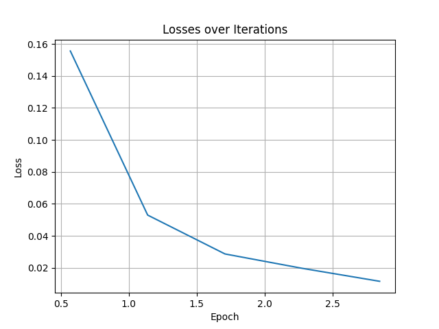

# BERT NER

## 1.模型概述

BERT NER是经过微调的BERT模型，用于命名实体识别（NER），识别并分类文本中的实体，如人名、日期和地点。来自于[Transformers](https://github.com/huggingface/transformers)，使用conll2003数据进行微调，训练环境为`transformers`。

## 2.快速开始

### 2.1环境配置

请参考[基础环境安装](https://gitee.com/tecorigin/modelzoo/blob/main/doc/Environment.md)章节，完成训练前的基础环境检查和安装。

```bash
pip install -r requirements.txt
pip install -e .
```

需要安装accelerate。

### 2.2数据集获取与准备

数据集来自于Hugging Face的[hub](https://huggingface.co/datasets)，理论上不需要手动下载，但是由于网络问题，手动将下载脚本储存在`conll2003/conll2003.py`。

### 2.3模型训练

运行以下命令进行训练。
```bash
bash examples/pytorch/token-classification/train_token_classification.sh
```

### 2.4结果展示

训练过程的loss如下图所示。



可以看出随着训练的进行loss呈现下降趋势。