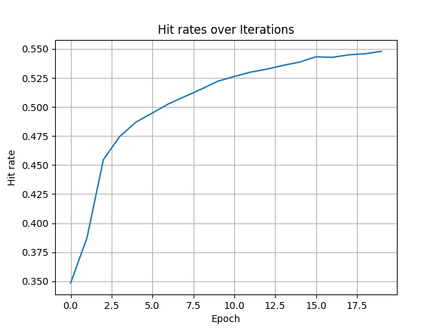

# NCF

## 1.模型概述

NCF是是一种一种结合了神经网络和协同过滤的推荐系统模型，预测用户和项目之间的交互，从而提高推荐的准确性。来自于[mlcommons](https://github.com/mlcommons/training_results_v0.5)，使用Movielens数据训练NCF模型，训练环境为`training_result_v0.5`。

## 2.快速开始

### 2.1环境配置

请参考[基础环境安装](https://gitee.com/tecorigin/modelzoo/blob/main/doc/Environment.md)章节，完成训练前的基础环境检查和安装。

```bash
pip install -r requirements.txt
```

### 2.2数据集获取与准备

使用以下命令下载数据集并对数据集进行预处理。
```bash
cd v0.5.0/nvidia/submission/code/recommendation
# Creates ml-20.zip
source recommendation/download_dataset.sh
# Confirms the MD5 checksum of ml-20.zip
source recommendation/verify_dataset.sh
# Unzip
unzip ml-20m.zip
# Preprocessing
python convert.py --path ./ml-20m/ratings.csv --output /data/ml-20m
```

### 2.3模型训练

使用以下命令训练NCF模型。
```bash
cd v0.5.0/nvidia/submission/code/recommendation/pytorch
bash train.sh
```
参数可以通过修改train.sh进行修改。

### 2.4结果展示

训练过程中的hit rate曲线如下图所示。



可以看出hit rate随着训练不断增大。