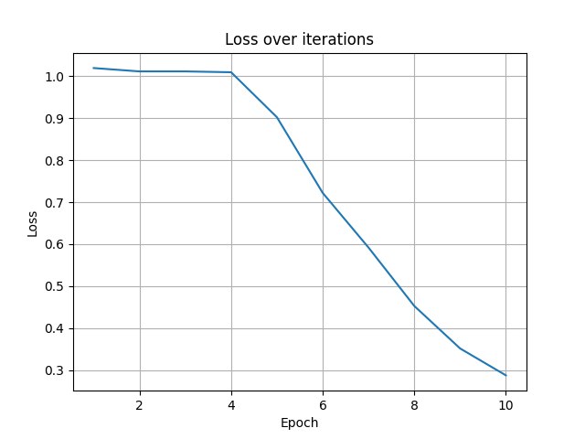

# RoBerta

## 1.模型概述

RoBerta是经过强优化的BERT模型，通过使用更大的批量、更丰富的数据以及去除一些训练限制，从而提高了BERT的性能。来自于[fairseq](https://github.com/facebookresearch/fairseq/tree/v0.10.2)，使用RTE数据对模型进行微调，训练环境为`fairseq`。

## 2.快速开始

### 2.1环境配置

请参考[基础环境安装](https://gitee.com/tecorigin/modelzoo/blob/main/doc/Environment.md)章节，完成训练前的基础环境检查和安装。

```bash
pip install -r requirements.txt
pip install -e .
```

### 2.2数据集获取与准备

数据集储存在/data/datasets/20241122/RTE.zip，解压至./glue_data/RTE，运行以下命令进行数据预处理。
```bash
bash ./examples/roberta/preprocess_GLUE_tasks.sh glue_data RTE
```

### 2.3预训练模型准备

下载[roberta_base](https://dl.fbaipublicfiles.com/fairseq/models/roberta.base.tar.gz)模型并解压存放至`./examples/roberta/pretrained`。

### 2.4模型训练

运行以下命令。
```bash
bash examples/roberta/train_roberta.sh
```

### 2.5结果展示

训练loss曲线如下图所示。



可以看出随着训练的进行，loss不断下降。

