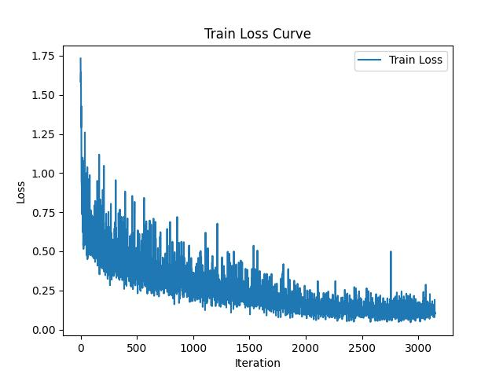
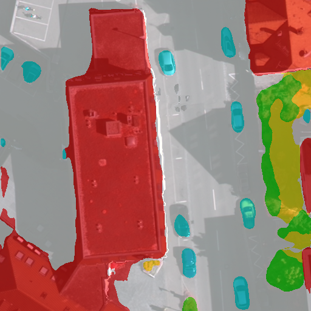

# Attn_Unet

## 模型概述
Attention U-Net 是一种改进的 U-Net 结构，用于提高图像分割的性能。U-Net 本身是一种常用于医学图像分割的卷积神经网络（CNN）结构，而 Attention U-Net 在其基础上引入了注意力机制，以更好地捕捉重要的特征信息。

## Quick Start Guide

### 1、环境准备

#### 1.1 拉取代码仓

``` bash
git clone https://gitee.com/tecorigin/modelzoo.git
```
#### 1.2 创建Teco虚拟环境

``` bash
cd /modelzoo/PyTorch/contrib/Segmentation/Attn_Unet
conda activate torch_env

# 执行以下命令验证环境是否正确，正确则会打印如下版本信息
python -c "import torch_sdaa"
```
<p align="center">
    
</p>

``` bash
# install requirements
pip install -r requirements.txt

# install tcsp_dllogger
git clone https://gitee.com/xiwei777/tcap_dlloger.git
cd tcap_dllogger
python setup.py install
```


### 2、数据集准备
#### 2.1 数据集介绍

我们在本项目中使用了 ISPRS Vaihingen 数据集。该数据集广泛应用于遥感图像分析和建筑物检测任务，提供了高分辨率的航空影像和对应的地面真值标签。这些影像涵盖了不同类型的地物，其类别如下图所示。数据集中的影像经过精确标注，可用于训练和评估深度学习模型。

| 像素值 | 类别名（英文）           | 类别名（中文） |
| ------ | ------------------------- | -------------- | 
| 0      | Other       | 其他     |
| 1      | Impervious surfaces       | 不透光表面     |
| 2      | Building                  | 建筑           |
| 3      | Low vegetation            | 低矮植被       | 
| 4      | Tree                      | 树木           |
| 5      | Car                       | 汽车           |
| 6      | Clutter/background        | 背景           | 


#### 2.2 从百度网盘中下载数据集
链接：https://pan.baidu.com/s/1UMbFw0dve9j2fErJ2R4PPQ \
提取码：v2eq

#### 2.3 解压数据集

解压训练数据集：

``` bash
unzip vaihingen_VOC.zip -d ./datasets/data
```

#### 2.4 数据集目录结构

vaihingen数据集目录结构参考如下所示(按照VOC格式整理):

```
└── vaihingen_VOC
    └── VOC2007
        ├── ImageSets
        │   └── Segmentation
        │       ├── train.txt
        │       └── val.txt
        ├── JPEGImages
        │   ├── area10_0_0_512_512.png
        │   ├── area10_0_1024_512_1536.png
        │   ├── ...
        └── SegmentationClass
            ├── area10_0_0_512_512.png
            ├── area10_0_1024_512_1536.png
            └── ...
```
与VOC2007数据集的结构相同，`ImageSets/Segmentation/`中存放的是数据集划分文件，`JPEGImages/`中存放的是原始影像（三通道png图片），`SegmentationClass/`中存放的是与每张原始影像对应的语义分割标注文件(灰度png图像，像素值代表类别)
train.txt、val.txt 的格式如下：

```
# 每一行均为对应的源图像和标注的文件名前缀

# 下面是 train_list.txt 中的格式样例
area11_0_0_512_512
area11_0_1024_512_1536
...

# 下面是 val_list.txt 中的格式样例
area10_0_0_512_512
area10_0_1024_512_1536
...
```

   > **说明：**
   > 该数据集的训练过程脚本只作为一种参考示例。


### 3、 启动训练
进入project根目录

``` bash
cd /workspace/Segmentation/Attn_Unet
```

在vaihingen数据集上训练150epoch，单卡DDP，开启amp得到的pth权重文件可在以下链接中下载，如果需要可以直接下载并将其存放到`/experiments/example`目录中，可以直接进行结果测试和可视化。\
\
链接：https://pan.baidu.com/s/1E5DBTm2stakFiLgyd7b6GQ \
提取码：f6nb

以下是从头开始训练的步骤
#### 3.1 训练命令
支持单机单SPA、单机单卡（DDP）以及断点重训。训练过程保存的权重以及日志均会保存在--work_dir中。

- 单机单SPA训练
    ```
    python run_scripts/run_torch_model.py --work_dir experiments/attn_unet --distributed False --use_amp True --default_rank 0 --model_name attn_unet --crop_val True --lr 0.01 --crop_size 512 --batch_size 4 --total_epochs 150 --val_epoch 5
    ```
- 单机单卡训练（DDP）
    ```
    python run_scripts/run_torch_model.py --nproc_per_node=4 --master_port=29505 --work_dir experiments/attn_unet --distributed True --use_amp True --default_rank 0 --model_name attn_unet --crop_val True --lr 0.01 --crop_size 512 --batch_size 4 --total_epochs 150 --val_epoch 5
    ```

断点重训只需在训练命令中加入--continue_training True, --ckpt {checkpoint file}

#### 3.2 模型训练脚本参数说明如下：

参数名 | 解释 | 样例
-----------------|-----------------|-----------------
work_dir |实验工作目录 | --work_dir experiments/attn_unet
data_root| 数据集根目录 | --data_root ./datasets/data
dataset | 数据集名称，可根据用户需求扩展 | --dataset vaihingen
num_classes | 数据集目标类别数，vaihingen为6 | --num_classes 6
model_name | 模型名称 | --model_name /attn_unet
distributed | 是否开启DDP| --distributed True
nproc_per_node | 每个节点上的进程数| --nproc_per_node 4
nnodes | 多机节点数| --nnodes 1
node_rank | 多机节点序号| --node_rank 0
master_addr | 多机主节点ip地址| --master_addr 192.168.1.1
master_port | 多机主节点端口号| --master_port 29505
use_amp | 是否使用amp | --use_amp True
default_rank| 默认进程号，主要用于DDP训练时指定主进程 |--default_rank 0
total_epochs| 训练总epoch数 |--total_epochs 150
optimizer| 优化器 |--optimizer sgd
lr| 学习率 |--lr 0.01
lr_policy| 学习率调整策略 |--lr_policy cosine
crop_val| 是否裁切后评估 |--crop_val False
batch_size| 训练时的batch size |--batch_size 4
val_batch_size| 评估时的batch size | --val_batch_size 1
crop_size| 图像裁切尺寸 | --crop_size 512
continue_training| 是否断点重训 | --val_batch_size 1
ckpt| 断点重训加载的checkpoint文件 | --ckpt experiments/example/best_attn_unet_vaihingen.pth
loss_type| 选择loss类型 | --loss_type sgd
weight_decay| 设置weight_decay | --weight_decay 0.0001
random_seed| 设置random_seed| --random_seed 1
print_interval| 输出日志间隔的iteration数 | --print_interval 5
val_epoch| 在验证集上进行评估间隔的epoch数 | --val_epoch 5

#### 3.3 测试命令
- 单机单SPA测试
    ```
    python run_scripts/run_torch_model.py --distributed False --ckpt experiments/example/best_attn_unet_vaihingen.pth --use_amp True --test_only True --default_rank 0 --model_name attn_unet --crop_val True --crop_size 512
    ```
- 单机单卡测试
    ```
    python run_scripts/run_torch_model.py --nproc_per_node=4 --master_port=29505 --distributed True --ckpt experiments/example/best_attn_unet_vaihingen.pth --use_amp True --test_only True --default_rank 0 --model_name attn_unet --crop_val True --crop_size 512
    ```

#### 3.4 可视化分割结果
可视化脚本为:`tools/visualizer.py`，其参数列表如下 
参数名 | 解释 | 样例
-----------------|-----------------|-----------------
ckpt | 用于模型推理的checkpoint文件 | --ckpt experiments/example/best_attn_unet_vaihingen.pth
img_file| 用于输入的图片文件 | --img_file datasets/data/vaihingen_VOC/VOC2007/JPEGImages/area1_0_0_512_512.png
mix | 是否使用mix可视化模式 | --mix True
alpha | mix模式下的分割结果图透明度 | --alpha 0.5
num_classes | 数据集目标类别数，vaihingen为6 | --num_classes 6
model_name | 模型名称 | --model_name /attn_unet
- 可视化命令
    ```
    python tools/visualizer.py
    ```
运行可视化脚本后，将会在会checkpoint文件同级目录中创建一个`vis_results/`目录用于存放可视化结果图

### 4、训练结果

| 芯片 |卡  | 模型 |  混合精度 |Batch size|Shape| 吞吐量|
|:-:|:-:|:-:|:-:|:-:|:-:|:-:|
|SDAA|1| Att_Unet |是|4|512*512| 19 img/s|

**训练结果量化指标如下表所示**

| 指标 |值  |
|:-:|:-:|
| Overall Acc | 85.59 |
| Mean Acc | 68.58 |
| FreqW Acc | 74.83 |
| Mean IoU | 69.94 |

| 目标类别 |IoU  |
|:-:|:-:|
| Impervious surfaces | 78.84 |
| Building | 82.17 |
| Low vegetation | 64.72 |
| Tree | 76.17 |
| Car | 48.78 |

**训练过程loss曲线如下图所示**
<p align="center">
    
</p>

**分割结果可视化示意图如下所示（左图为原图，右图为模型预测的分割结果可视化图）**
<p align="center">
  
  
</p>
