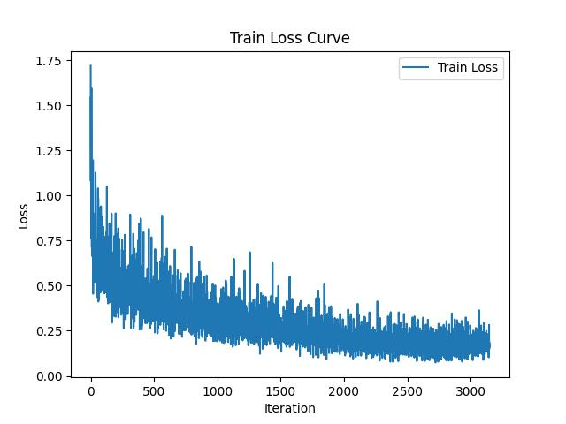
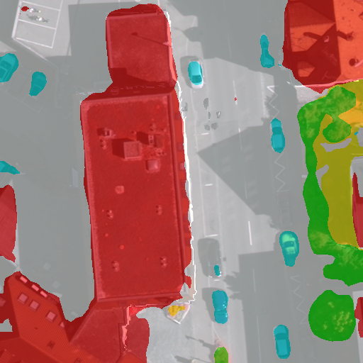

# FCN

## 1. 模型概述
全卷积网络（FCN）是一种用于语义分割的经典模型，完全由卷积层和池化层构成，没有全连接层，使其能够处理任意尺寸的输入图像。通过卷积和池化提取特征，再使用反卷积（上采样）恢复到原始尺寸，结合skip connections机制融合多层次特征，实现像素级别的分类。FCN模型高效、灵活，保留了丰富的空间信息，广泛应用于自然图像、医学图像和遥感图像的分割任务。

文章链接：https://openaccess.thecvf.com/content_cvpr_2015/papers/Long_Fully_Convolutional_Networks_2015_CVPR_paper.pdf

## 2. 快速开始

### 2.1 基础环境安装

请参考[基础环境安装](../../../../doc/Environment.md)章节，完成训练前的基础环境检查和安装。


### 2.2 数据集准备
#### 2.2.1 数据集介绍

我们在本项目中使用了 ISPRS Vaihingen 数据集。该数据集广泛应用于遥感图像分析和建筑物检测任务，提供了高分辨率的航空影像和对应的地面真值标签。这些影像涵盖了不同类型的地物，其类别如下图所示。数据集中的影像经过精确标注，可用于训练和评估深度学习模型。

| 像素值 | 类别名（英文）           | 类别名（中文） |
| ------ | ------------------------- | -------------- | 
| 0      | Other       | 其他     |
| 1      | Impervious surfaces       | 不透光表面     |
| 2      | Building                  | 建筑           |
| 3      | Low vegetation            | 低矮植被       | 
| 4      | Tree                      | 树木           |
| 5      | Car                       | 汽车           |
| 6      | Clutter/background        | 背景           | 


#### 2.2.2 从百度网盘中下载数据集
链接：https://pan.baidu.com/s/1UMbFw0dve9j2fErJ2R4PPQ \
提取码：v2eq

#### 2.2.3 解压数据集

解压训练数据集：

``` bash
unzip vaihingen_VOC.zip -d ./datasets/data
```

#### 2.2.4 数据集目录结构

vaihingen数据集目录结构参考如下所示(按照VOC格式整理):

```
└── vaihingen_VOC
    └── VOC2007
        ├── ImageSets
        │   └── Segmentation
        │       ├── train.txt
        │       └── val.txt
        ├── JPEGImages
        │   ├── area10_0_0_512_512.png
        │   ├── area10_0_1024_512_1536.png
        │   ├── ...
        └── SegmentationClass
            ├── area10_0_0_512_512.png
            ├── area10_0_1024_512_1536.png
            └── ...
```
与VOC2007数据集的结构相同，`ImageSets/Segmentation/`中存放的是数据集划分文件，`JPEGImages/`中存放的是原始影像（三通道png图片），`SegmentationClass/`中存放的是与每张原始影像对应的语义分割标注文件(灰度png图像，像素值代表类别)
train.txt、val.txt 的格式如下：

```
# 每一行均为对应的源图像和标注的文件名前缀

# 下面是 train_list.txt 中的格式样例
area11_0_0_512_512
area11_0_1024_512_1536
...

# 下面是 val_list.txt 中的格式样例
area10_0_0_512_512
area10_0_1024_512_1536
...
```

   > **说明：**
   > 该数据集的训练过程脚本只作为一种参考示例。

### 2.3 构建环境
所使用的环境下已经包含PyTorch框架虚拟环境
1. 执行以下命令，启动虚拟环境。
``` bash
cd <ModelZoo_path>/PyTorch/contrib/Segmentation/FCN

conda activate torch_env

# 执行以下命令验证环境是否正确，正确则会打印如下版本信息
python -c "import torch_sdaa"
```
<p align="center">
    
</p>

2. 安装python依赖
``` bash
# install requirements
pip install -r requirements.txt

# install tcsp_dlloger
git clone https://gitee.com/xiwei777/tcap_dlloger.git
cd tcap_dllogger
python setup.py install
```

### 2.4 启动训练
1. 在构建好的环境中，进入训练脚本所在目录。
    ```
    cd <ModelZoo_path>/PyTorch/contrib/Segmentation/FCN
    ```


注：在vaihingen数据集上训练150epoch，4卡DDP，开启amp得到的pth权重文件可在以下链接中下载，如果需要可以直接下载并将其存放到`/experiments/example`目录中，可以直接进行结果测试和可视化。\
\
链接：https://pan.baidu.com/s/16kFTTobes51fh1RylvkxyQ \
提取码：ek5z 

2. 运行训练。该模型支持单机单SPA、单机单卡（DDP）以及断点重训。训练过程保存的权重以及日志均会保存在--work_dir中。

- 单机单SPA训练
    ```
    python run_scripts/run_fcn.py --device sdaa --work_dir experiments/fcn --distributed False --use_amp True --default_rank 0 --model_name fcn --crop_val True --lr 0.01 --crop_size 512 --batch_size 4 --total_epochs 150 --val_epoch 5
    ```
- 单机单卡训练（DDP）
    ```
    python run_scripts/run_fcn.py --nproc_per_node=4 --master_port=29505 --device sdaa --work_dir experiments/fcn --distributed True --use_amp True --default_rank 0 --model_name fcn --crop_val True --lr 0.01 --crop_size 512 --batch_size 4 --total_epochs 150 --val_epoch 5
    ```

断点重训只需在训练命令中加入--continue_training True, --ckpt {checkpoint file}

更多训练参数参考[README](run_scripts/README.md)

### 2.4 启动测试
- 单机单SPA测试
    ```
    python run_scripts/run_fcn.py --distributed False --device sdaa --ckpt experiments/example/best_fcn_vaihingen.pth --use_amp True --test_only True --default_rank 0 --model_name fcn --crop_val True --crop_size 512
    ```
- 单机单卡测试
    ```
    python run_scripts/run_fcn.py --nproc_per_node=4 --master_port=29505 --distributed True --device sdaa --ckpt experiments/example/best_fcn_vaihingen.pth --use_amp True --test_only True --default_rank 0 --model_name fcn --crop_val True --crop_size 512
    ```

### 2.5 可视化分割结果
可视化脚本为:`tools/visualizer.py`，其参数列表如下 
参数名 | 解释 | 样例
-----------------|-----------------|-----------------
ckpt | 用于模型推理的checkpoint文件 | --ckpt experiments/example/best_fcn_vaihingen.pth
img_file| 用于输入的图片文件 | --img_file datasets/data/vaihingen_VOC/VOC2007/JPEGImages/area1_0_0_512_512.png
mix | 是否使用mix可视化模式 | --mix True
alpha | mix模式下的分割结果图透明度 | --alpha 0.5
num_classes | 数据集目标类别数，vaihingen为6 | --num_classes 6
model_name | 模型名称 | --model_name /fcn
device | device名称 | --device sdaa
- 可视化命令
    ```
    python tools/visualizer.py --device sdaa
    ```
运行可视化脚本后，将会在会checkpoint文件同级目录中创建一个`vis_results/`目录用于存放可视化结果图

### 2.5 训练结果

| 芯片 |卡  | 模型 |  混合精度 |Batch size|Shape| 吞吐量|
|:-:|:-:|:-:|:-:|:-:|:-:|:-:|
|SDAA|1| FCN |是|4|512*512| 28 img/s|

**训练结果量化指标如下表所示**

| 指标 |值  |
|:-:|:-:|
| Overall Acc | 84.97 |
| Mean Acc | 68.33 |
| FreqW Acc | 73.7 |
| Mean IoU | 68.48 |

| 目标类别 |IoU  |
|:-:|:-:|
| Impervious surfaces | 76.66 |
| Building | 79.63 |
| Low vegetation | 64.87 |
| Tree | 76.17 |
| Car | 45.08 |

**训练过程loss曲线如下图所示**
<p align="center">
    
</p>

**分割结果可视化示意图如下所示（左图为原图，右图为模型预测的分割结果可视化图）**
<p align="center">
  
  
</p>
