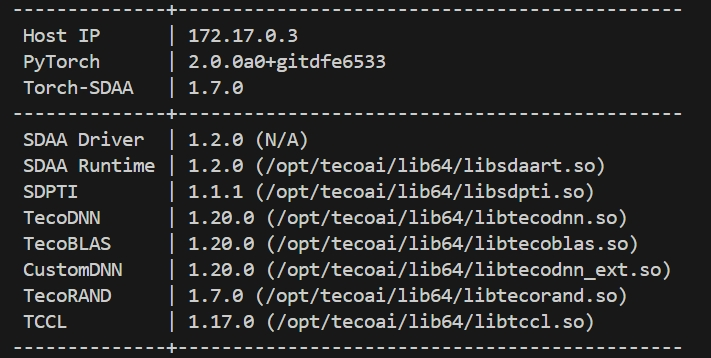
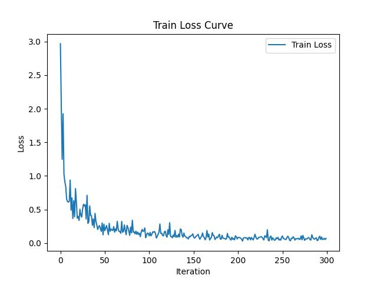

# PSPNet50

## 1. 模型概述
PSPNet50（Pyramid Scene Parsing Network，基于ResNet-50的版本）是一种用于图像语义分割的深度学习网络。该模型通过金字塔池化模块（Pyramid Pooling Module，PPM）来捕捉多尺度上下文信息，有效提升了在复杂场景下对不同大小物体的分割能力。PSPNet50使用了ResNet-50作为骨干网络（backbone），通过提取特征图并结合不同尺度的上下文信息，生成精细的分割预测。其优势在于通过金字塔池化能够在全局语境中对图像中的每个像素进行理解，使其在城市街景、遥感等语义分割任务中表现优异。PSPNet50因其良好的平衡性，在精度和计算开销上达到了较优的效果。

文章链接：https://arxiv.org/pdf/1612.01105.pdf

## 2. 快速开始

### 2.1 基础环境安装

请参考[基础环境安装](../../../../doc/Environment.md)章节，完成训练前的基础环境检查和安装。


### 2.2 数据集准备
#### 2.2.1 数据集介绍

VOC2007分割数据集是PASCAL VOC挑战赛中一个重要的子数据集，主要用于图像语义分割任务。该数据集包含了来自20个类别的图像和像素级别的语义标签，类别涵盖常见物体如飞机、汽车、猫、狗、家具等，以及背景类。每个图像中的物体都被标注了对应的类别，像素被赋予特定的RGB值来表示物体的类别。数据集提供的RGB像素值与物体类别一一对应，允许训练深度学习模型进行精确的物体分割。该数据集广泛用于计算机视觉研究，特别是在评估图像分割和物体识别算法的性能上。其类别如下图所示。

| RGB像素值      | 类别名（英文）           | 类别名（中文） |
| -------------- | ------------------------- | -------------- | 
| (0, 0, 0)      | Background                 | 背景           |
| (128, 0, 0)    | Aeroplane                  | 飞机           |
| (0, 128, 0)    | Bicycle                    | 自行车         |
| (128, 128, 0)  | Bird                       | 鸟类           |
| (0, 0, 128)    | Boat                       | 船只           |
| (128, 0, 128)  | Bottle                     | 瓶子           |
| (0, 128, 128)  | Bus                        | 公交车         |
| (128, 128, 128)| Car                        | 汽车           |
| (64, 0, 0)     | Cat                        | 猫             |
| (192, 0, 0)    | Chair                      | 椅子           |
| (64, 128, 0)   | Cow                        | 奶牛           |
| (192, 128, 0)  | Diningtable                | 餐桌           |
| (64, 0, 128)   | Dog                        | 狗             |
| (192, 0, 128)  | Horse                      | 马             |
| (64, 128, 128) | Motorbike                  | 摩托车         |
| (192, 128, 128)| Person                     | 人             |
| (0, 64, 0)     | Pottedplant                | 盆栽           |
| (128, 64, 0)   | Sheep                      | 绵羊           |
| (0, 192, 0)    | Sofa                       | 沙发           |
| (128, 192, 0)  | Train                      | 火车           |
| (0, 64, 128)   | Tvmonitor                  | 电视/显示器    |


#### 2.2.2 下载数据集和预训练权重
数据集官网链接：http://host.robots.ox.ac.uk/pascal/VOC/voc2007/ \
预训练权重链接：https://pan.baidu.com/s/1HAX27mJSBZKfz8IDHptIVA 
提取码: 43mi 
resnet预训练权重存放位置：./models/resnet50_v2.pth

#### 2.2.3 解压数据集并转换标签

解压训练数据集：

``` bash
tar -xvf VOCtrainval_06-Nov-2007.tar -C /mnt/nvme/common/train_dataset/voc
```
并运行标签转换脚本得到灰度标签图：
``` bash
python ./tools/convert_voc_label.py --input_dir /mnt/nvme/common/train_dataset/voc/VOC2007/SegmentationClass --output_dir /mnt/nvme/common/train_dataset/voc/VOC2007/SegmentationClassGray
```

#### 2.2.4 数据集目录结构

VOC数据集目录结构参考如下所示:

```
└── VOCdevkit
    └── VOC2007
        ├── Annotations
        │   ├── 000001.xml
        │   ├── 000002.xml
        │   ├── ...
        ├── ImageSets
        │   ├── Action
        │   │   ├── test.txt
        │   │   └── trainval.txt
        │   ├── Layout
        │   │   ├── test.txt
        │   │   └── trainval.txt
        │   ├── Main
        │   │   ├── test.txt
        │   │   ├── train.txt
        │   │   ├── trainval.txt
        │   │   └── val.txt
        │   └── Segmentation
        │       ├── train.txt
        │       ├── trainval.txt
        │       └── val.txt
        ├── JPEGImages
        │   ├── 000001.jpg
        │   ├── 000002.jpg
        │   ├── ...
        ├── SegmentationClass
        │   ├── 000001.png
        │   ├── 000002.png
        │   ├── ...
        └── SegmentationObject
            ├── 000001.png
            ├── 000002.png
            └── ...

```


### 2.3 构建环境
所使用的环境下已经包含PyTorch框架虚拟环境
1. 执行以下命令，启动虚拟环境。
``` bash
cd <ModelZoo_path>/PyTorch/contrib/Segmentation/PSPNet50

conda activate torch_env

# 执行以下命令验证环境是否正确，正确则会打印如下版本信息
python -c "import torch_sdaa"
```
<p align="center">
    
</p>

2. 安装python依赖
``` bash
# install requirements
pip install -r requirements.txt

# install tcsp_dlloger
pip install git+https://gitee.com/xiwei777/tcap_dllogger.git
```

### 2.4 启动训练
1. 在构建好的环境中，进入训练脚本所在目录。
    ```
    cd <ModelZoo_path>/PyTorch/contrib/Segmentation/PSPNet50
    ```

2. 运行训练。该模型支持单机单SPA、单机单卡（DDP）以及断点重训。训练过程保存的权重以及日志均会保存在--work_dir中。

- 单机单SPA训练
    ```
    python run_scripts/run_pspnet.py --device sdaa --work_dir experiments/pspnet --distributed False --autocast True --default_rank 0 --model_name pspnet --num_classes 20 --dataset_path /mnt/nvme/common/train_dataset/voc --crop_val True --lr 0.00005 --optimizer adam --crop_size 513 --batch_size 4 --epoch 50 --val_epoch 5 --print_interval 5
    ```
- 单机单卡训练（DDP）
    ```
    python run_scripts/run_pspnet.py --nproc_per_node=4 --master_port=29505 --device sdaa --work_dir experiments/pspnet --distributed True --autocast True --num_classes 20 --default_rank 0 --model_name pspnet --dataset_path /mnt/nvme/common/train_dataset/voc --crop_val True --lr 0.0001 --optimizer adam --crop_size 513 --batch_size 8 --epoch 50 --val_epoch 5
    ```

断点重训只需在训练命令中加入--continue_training True, --ckpt {checkpoint file}

更多训练参数参考[README](run_scripts/README.md)

### 2.5 启动测试
- 单机单SPA测试
    ```
    python run_scripts/run_pspnet.py --distributed False --device sdaa --dataset_path /mnt/nvme/common/train_dataset/voc --ckpt experiments/pspnet/best_pspnet_voc.pth --autocast True --test_only True --default_rank 0 --model_name pspnet --crop_val True --crop_size 513
    ```
- 单机单卡测试
    ```
    python run_scripts/run_pspnet.py --nproc_per_node=4 --master_port=29505 --distributed True --device sdaa --dataset_path /mnt/nvme/common/train_dataset/voc --ckpt experiments/pspnet/best_pspnet_voc.pth --autocast True --test_only True --default_rank 0 --model_name pspnet --crop_val True --crop_size 513
    ```

### 2.6 训练结果

| 芯片 |卡  | 模型 |  混合精度 |Batch size|Shape| 吞吐量|
|:-:|:-:|:-:|:-:|:-:|:-:|:-:|
|SDAA|1| PSPNet50 |是|8|513*513| 8 img/s|

**训练结果量化指标如下表所示**

| 指标 |值  |
|:-:|:-:|
| Overall Acc | 77.18 |
| Mean Acc | 75.04 |
| FreqW Acc | 63.93 |
| Mean IoU | 71.4 |

| 目标类别 |IoU  |
|:-:|:-:|
| aeroplane | 71.36 |
| bicycle | 52.61 |
| bird | 81.24 |
| boat | 81.02 |
| bottle | 70.78 |
| bus | 59.63 |
| car | 63.45 |
| cat | 73.65 |
| chair | 42.85 |
| cow | 33.36 |
| diningtable | 68.75 |
| dog | 55.13 |
| horse | 55.09 |
| motorbike | 72.19 |
| person | 80.22 |
| pottedplant | 71.09 |
| sheep | 16.36 |
| sofa | 23.78 |
| train | 63.64 |
| tvmonitor | 81.76 |

**训练过程loss曲线如下图所示**
<p align="center">
    
</p>

