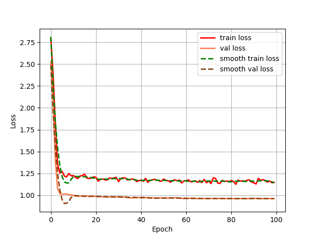
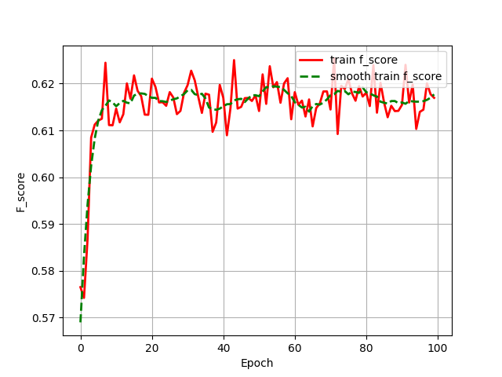

 # segformer：语义分割模型segformer在Pytorch当中的实现
 
## 1、模型概述
SegFormer是一种简单高效的语义分割框架，它结合了Transformer编码器和轻量级多层感知机解码器。

## 2、快速开始
使用本模型执行训练的主要流程如下：

1.运行环境配置：介绍训练前需要完成的运行环境配置和检查。

2.数据集准备：介绍如何使用如何获取并处理数据集。

3.启动训练：介绍如何运行训练。
### 2.1、运行环境配置
#### 2.1.1 拉取代码仓
```python
git clone https://gitee.com/tecorigin/modelzoo.git
```

#### 2.1.2 创建Teco虚拟环境
```python
cd /modelzoo/PyTorch/contrib/faster_net
conda activate torch_env
pip install -r requirements.txt
```
### 2.2、数据集准备
#### 2.2.1 数据集介绍
VOC数据集是一个世界级的计算机视觉挑战赛PASCAL VOC挑战赛所提出的数据集，用于分类和检测的数据集规模为：train/val ：11540 张图片，包含 27450 个已被标注的 ROI annotated objects ；用于分割的数据集规模为：trainval：2913张图片，6929个分割，
#### 2.2.2 数据集下载
VOC数据集下载地址如下，里面已经包括了训练集、测试集、验证集（与测试集一样），无需再次划分：  
链接: https://pan.baidu.com/s/1vkk3lMheUm6IjTXznlg7Ng
提取码: 44mk
#### 2.2.3 数据集处理
```python
unzip VOCdevkit.zip
# 解压即可
```

### 2.3、启动训练
训练命令：支持单机单SPA。训练过程保存的权重以及日志均会保存在"logs"中。\

单机单SPA（混合精度）
```python
python run_scripts/run_train.py  --model_name=segformer  --epoch=100  --batch_size=8  --nproc_per_node=1  --device=sdaa  --use_amp=True  --use_ddp=False  --dataset_path=VOCdevkit
```

### 2.4 训练结果
训练条件

| 芯片   | 卡 | 模型          | 混合精度 | batch size |
|------|---|-------------|------|------------|
| SDAA | 1 | segformer | 是    | 8          |

训练结果量化指标如下表所示

| 加速卡数量 | epoch | 混合精度 | batch size | f_score |
|-------|-------|------|------------|---------|
| 1     | 100    | 是    | 8          | 0.62   |

训练过程loss曲线如下图所示\
 \
f_score图如下所示 \
