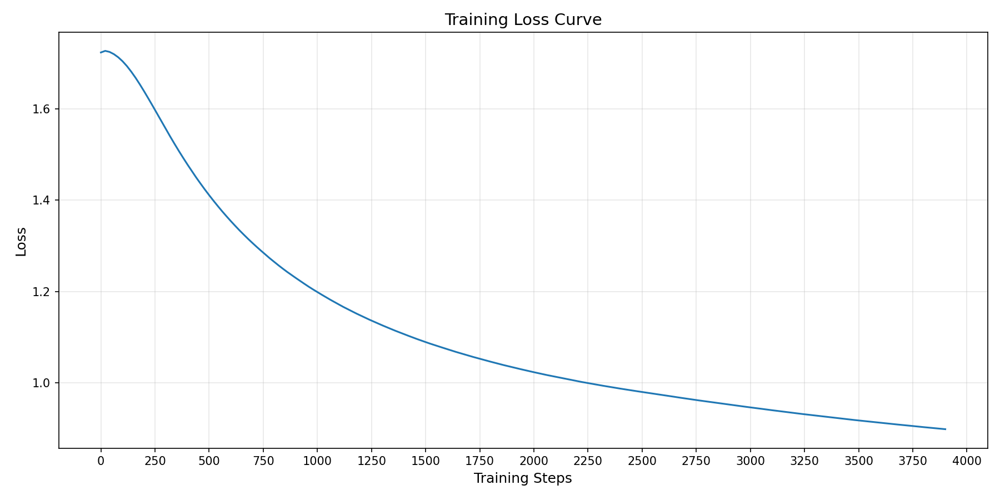

# MAE

## 1. 模型概述

**MAE (Masked Autoencoders)**  属于自监督学习（Self-Supervised Learning）范畴，主要思想是在图像上随机遮挡（Mask）一部分 Patch，然后让模型仅根据剩余的可见 Patch 重构出缺失部分。通过这样的大规模预训练，模型能够学到更具泛化性的图像表征，从而在下游任务（如图像分类、目标检测、语义分割等）中获得更好的性能或更快的收敛速度。

> 本项目基于 [facebookresearch/mae](https://github.com/facebookresearch/mae)，参考 commit ID: [`efb2a80`](https://github.com/facebookresearch/mae/commit/efb2a8062c206524e35e47d04501ed4f544c0ae8)

---

## 2. 快速开始
以下说明旨在帮助您快速搭建并运行 MAE 模型进行训练。整体流程如下所示：
1. [基础环境安装](#21-基础环境安装)：介绍训练前需要完成的基础环境检查和安装。
2. [获取并准备数据集](#22-准备数据集)：介绍如何获取训练所需的数据集。
3. [构建运行环境](#23-构建环境)：介绍如何构建模型运行所需要的环境
4. [启动训练](#24-启动训练)：介绍如何运行训练。

### 2.1 基础环境安装
请参考[基础环境安装](../../../../doc/Environment.md)章节，完成训练前的基础环境检查和安装。  

### 2.2 准备数据集
#### 2.2.1 获取数据集
MAE 官方使用 **ImageNet** 进行训练和评估。通常做法如下：
- 从 [ImageNet 官网](https://www.image-net.org/) 申请并下载原始数据集。
- 解压后应包含 `train` 和 `val` 两个文件夹。
- 数据集结构示例：

    ```text
    imagenet
    ├── train
    │   ├── class1
    │   ├── class2
    │   └── ...
    └── val
        ├── class1
        ├── class2
        └── ...
    ```

#### 2.2.2 处理数据集
- 确保将解压后的 ImageNet 数据集放置在 `/data/datasets/imagenet` 目录下
- 最终数据集路径示例：
   ```
   /data/datasets
   └── imagenet
       ├── train
       └── val
   ```

### 2.3 构建环境
所使用的环境下已经包含 PyTorch 框架虚拟环境。

1. **执行以下命令，启动虚拟环境**：
    ```bash
    conda activate torch_env
    ```

2. **安装 Python 依赖**  
   在启动虚拟环境后，执行以下命令安装项目所需的依赖：
   ```bash
   pip install -r requirements.txt
   ```

3. **修改 timm 适配当前 PyTorch 版本**  
   由于当前 PyTorch 版本对 `torch._six` 兼容性发生变化，需要对 `timm` 包进行修改：

   ```bash
    sed -i 's|^from torch\._six import container_abcs|import collections.abc as container_abcs|' \
    "$(python -m pip show timm | awk '/Location:/{print $2}')/timm/models/layers/helpers.py"
   ```

### 2.4 启动训练
1. **在构建好的环境中，进入训练脚本所在目录**：
    ```bash
    cd "<ModelZoo_path>/PyTorch/contrib/SelfSupervisedLearning/MAE/scripts"
    ```

2. **开始训练**

   **方法一：使用 Shell 脚本启动（默认单机单卡，`epochs=1`）**
   ```bash
   bash train_sdaa_3rd.sh
   ```
   
   **方法二：使用 `torchrun` 命令启动**  
   单机单核组：
   ```bash
   torchrun --standalone --nnodes=1 --nproc_per_node=1 ../main_pretrain.py \
       --epochs 800 \
       --norm_pix_loss \
       --blr 1.5e-4 
   ```
   单机单卡：
   ```bash
   torchrun --standalone --nnodes=1 --nproc_per_node=4 ../main_pretrain.py \
       --epochs 800 \
       --norm_pix_loss \
       --blr 1.5e-4 
   ```

   **更多训练参数**  
   请参考脚本目录下的 [README](./scripts/README.md) 获取更多参数说明。

### 2.5 训练结果

#### 2.5.1 训练配置：
使用 `train_sdaa_3rd.sh` 训练了 3900 步
#### 2.5.2 日志概览：  
   - 初始 loss 在 `1.72` 左右，随着迭代逐渐下降；  
   - 迭代到 3900 步(共 5004 步)时，loss 降至约 `0.90` 附近；  
   - 单个迭代（iteration）耗时大约在 `9.5s ~ 10.6s` 左右（不同阶段略有波动），整个 epoch 预计 **十余小时** 完成。  

#### 2.5.3 最终指标(单 Epoch 结束后，供参考)： 
   - **最终训练 loss：** 约 `0.89~0.90` (根据收敛趋势推断，或略更低)  
   - **训练总时长：** 约 **14 小时**
   - 由于只进行了 **不到 1 个 Epoch** 的预训练，整体 loss  尚未达到完全收敛，只能作为一个简单的演示结果或快速验证；如需充分训练，请增加 Epoch 数到 800。 

示例训练的 loss 曲线如下（示例图）:


- **初始 loss**: 1.7233  
- **最终 loss**: 0.8989  
