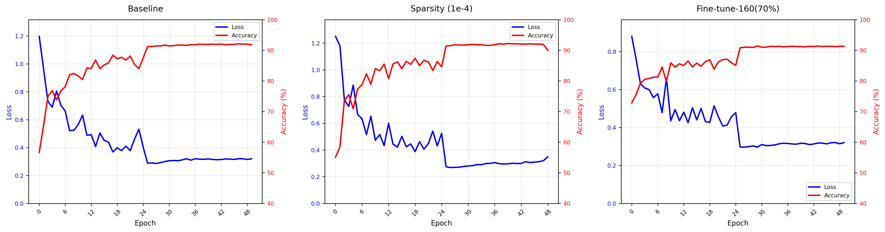

# Network Slimming

## 1. 模型概述

**Network Slimming** 是一种自监督学习方法，旨在通过对卷积神经网络（CNN）进行通道级别的剪枝，实现模型压缩和加速。其核心思想是在训练过程中对批量归一化（Batch Normalization, BN）层的缩放因子（γ）施加 L1 正则化，使部分通道的缩放因子趋近于零。在训练完成后，将这些缩放因子接近零的通道视为不重要通道，并予以剪枝。通过这种方式，模型能够自动识别并移除冗余的通道，从而在保持精度的同时，显著减少模型的参数量和计算量。

> 本项目基于 [Eric-mingjie/network-slimming](https://github.com/Eric-mingjie/network-slimming)，参考 commit ID: [`b395dc0`](https://github.com/Eric-mingjie/network-slimming/commit/b395dc07521cbc38f741d971a18fe3f6423c9ab1)

---

## 2. 快速开始
以下说明旨在帮助您快速搭建并运行 Network Slimming 模型进行训练。整体流程如下所示：
1. [基础环境安装](#21-基础环境安装)：介绍训练前需要完成的基础环境检查和安装。
2. [获取并准备数据集](#22-准备数据集)：介绍如何获取训练所需的数据集。
3. [构建运行环境](#23-构建环境)：介绍如何构建模型运行所需要的环境
4. [启动训练](#24-启动训练)：介绍如何运行训练。

### 2.1 基础环境安装
请参考[基础环境安装](../../../../doc/Environment.md)章节，完成训练前的基础环境检查和安装。  

### 2.2 准备数据集
#### 2.2.1 获取数据集
Network Slimming 的实验使用 **CIFAR-10** 进行训练和评估。通常做法如下：
- 从 [CIFAR-10 官网](https://www.cs.toronto.edu/~kriz/cifar.html) 下载原始数据集。
- 解压后的数据集结构示例：

    ```text
   cifar-10-batches-py
   ├── batches.meta
   ├── data_batch_1
   ├── data_batch_2
   ├── data_batch_3
   ├── data_batch_4
   ├── data_batch_5
   ├── test_batch
   ├── readme.html
   └── test_batch
    ```

#### 2.2.2 处理数据集
- 确保将解压后的 CIFAR-10 数据集放置在 `/data/datasets/Network-Slimming` 目录下
- 最终数据集路径示例：
   ```
   /data/datasets/Network-Slimming
   └── cifar-10-batches-py
       ├── batches.meta
       └── ...
   ```

### 2.3 构建环境
所使用的环境下已经包含 PyTorch 框架虚拟环境。

1. **执行以下命令，启动虚拟环境**：
    ```bash
    conda activate torch_env
    ```
2. **安装 Python 依赖**  
   在启动虚拟环境后，执行以下命令安装项目所需的依赖：
   ```bash
   pip install -r requirements.txt
   ```

### 2.4 启动训练
1. **在构建好的环境中，进入训练脚本所在目录**：
    ```bash
    cd "<ModelZoo_path>/PyTorch/contrib/Slim/Network-Slimming/scripts"
    ```

2. **开始训练**

   **方法一：使用 Shell 脚本启动（默认单机单卡）**
   ```bash
   bash train_sdaa_3rd.sh
   ```
   
   **方法二：使用 `torchrun` 命令启动**  
   单机单核组：
   ```bash
   torchrun --standalone --nnodes=1 --nproc_per_node=1 ../main.py --epochs 15 -sr
   ```
   单机单卡：
   ```bash
   torchrun --standalone --nnodes=1 --nproc_per_node=4 ../main.py --epochs 15 -sr
   ```


### 2.5 训练结果

#### 2.5.1 训练配置：
使用 `train_sdaa_3rd.sh`

#### 2.5.3 最终指标(供参考)： 
|  CIFAR10-Vgg  | Baseline | Sparsity (1e-4) | Fine-tune-160(70%) |
| :---------------: |:--------:|:---------------:|:------------------:|
| Top1 Accuracy (%) |  92.07   |      92.17      |       91.40        |
|    Parameters     |  20.04M  |     20.04M      |       2.25M        |

示例训练的 loss 和 accuracy 曲线如下（示例图）:

