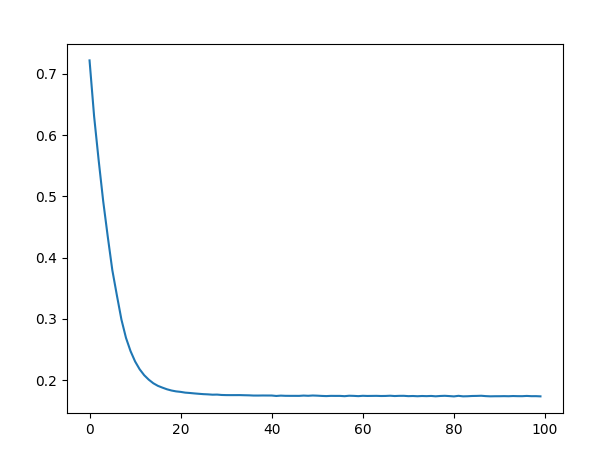

# RMVPE

## 模型概述
RMVPE是一种鲁棒的复调音乐音高估计模型，具有目前最高精准程度的f0预测效果，由中国人民大学提出。作者受音乐源分离模型启发，设计了基于深度U-Net和GRU的模型架构（图1，2）。将输入音频转为梅尔谱后，由二维卷积层、反卷积层构成的U-Net结构解读深度特征，最后通过时序模型“双向GRU”来完成对每帧音高的估计。作者在MDB-stem-synth, MIR-1K, Cmedia以及MIR ST500四个带有音高标定的数据集上进行了实验，并在绝对音高准确率（RPA)、音高色度准确率(RCA)、包含了非旋律帧判定的总体准确率(OA)三个评估指标下证明了RMVPE在各种场景下优秀的音高提取能力。对于带有背景音的人声，端到端的模型架构使得RMVPE避免了先分离伴奏、再提取干声音高这一管线存在的叠加误差问题，总体成绩要远好于管线式方法，以及其他现有的端到端模型。RMVPE在众多SVC（Singing Voice Conversion）以及SVS（Singing Voice Synthesis）任务中具有极高的精度表现，因此RMVPE已经成为众多语音界模型如 搜为此（So-vits）、韵泉唱（YQ maintained diffsinger）、地府唱（Diffsinger）、大市唱（AllSing）的f0数据首选提取模型。

## Quick Start Guide

### 1、环境准备

#### 1.1 拉取代码仓

``` bash
git clone https://gitee.com/tecorigin/modelzoo.git
```

#### 1.2 环境准备

##### 1.2.1 创建Teco环境

``` bash
cd /modelzoo/PyTorch/contrib/Speech/RMVPE
conda activate torch_env

# 执行以下命令验证环境是否正确，正确则会打印如下版本信息
python -c "import torch_sdaa"

>>> --------------+----------------------------------------------
>>>  Host IP      | X.X.X.X
>>>  PyTorch      | 2.0.0a0+gitdfe6533
>>>  Torch-SDAA   | 1.3.0
>>> --------------+----------------------------------------------
>>>  SDAA Driver  | 1.0.0 (N/A)
>>>  SDAA Runtime | 1.0.0 (/opt/tecoai/lib64/libsdaart.so)
>>>  SDPTI        | 1.0.0 (/opt/tecoai/lib64/libsdpti.so)
>>>  TecoDNN      | 1.15.0 (/opt/tecoai/lib64/libtecodnn.so)
>>>  TecoBLAS     | 1.15.0 (/opt/tecoai/lib64/libtecoblas.so)
>>>  CustomDNN    | 1.15.0 (/opt/tecoai/lib64/libtecodnn_ext.so)
>>>  TCCL         | 1.14.0 (/opt/tecoai/lib64/libtccl.so)
>>> --------------+----------------------------------------------
```

##### 1.2.1 准备依赖

使用pip安装依赖：
```Bash
pip install -r requirements.txt
```

### 2、数据集准备
#### 2.1 数据集说明

RMVPE支持MIR-1K数据集。

通过运行以下脚本进行数据集下载。

```Bash
python run_scripts/prepare_MIR_1K.py
```

#### 2.3 数据集目录结构

在rmvpe目录下按照该数据结构放置文件：

```
└──Hybrid
    ├──train
    │  ├──语音1.wav
    │  ├──语音2.wav
    │  ├──语音1.pv
    │  ├──语音2.pv
    │  └── ...
    │   
    └──test
       ├──语音1.wav
       ├──语音2.wav
       ├──语音1.pv
       ├──语音2.pv
       └── ...
```

其中train文件夹下为用于训练的数据，test文件夹下为测试的数据。如果你运行了`run_scripts/prepare_MIR_1K.py`，那么数据集将会被自动放置。

### 3、 启动训练

可以直接启动run_scripts/train.py文件进行短训体验，也可以传入其他参数进行个性化。
``` bash
cd /modelzoo/PyTorch/contrib/Speech/RMVPE
```
#### 3.1 模型训练脚本参数说明如下：

参数名 | 解释 | 样例（默认数据） | 是否必须及原因
-----------------|-----------------|-----------------|-----------------
logdir | 日志保存路径 | --logdir "runs/Hybrid" | 否，因为有默认参数
hop_length | 跳跃步长 | --hop_length 160 | 否，因为有默认参数
learning_rate | 学习率 | --learning_rate 0.0005 | 否，因为有默认参数
batch_size | 每个rank的batch_size | --batch_size 32 | 否，因为有默认参数
validation_interval | 每个多少步验证 | --validation_interval 50 | 否，因为有默认参数
clip_grad_norm | 梯度最大范数，超出就裁剪 | --clip_grad_norm 3 | 否，因为有默认参数
nproc_per_node | DDP时，进程的数量。| --nproc_per_node 4 | 否，因为有默认参数。
iterations | 迭代次数，默认迭代100步 | --iterations 100 | 否，因为有默认参数。
learning_rate_decay_steps | 学习率衰减的步数 | --learning_rate_decay_steps 2000 | 否，因为有默认参数。
learning_rate_decay_rate | 学习率衰减率 | --learning_rate_decay_rate 0.98 | 否，因为有默认参数。
resume_iteration | 恢复哪一步开始训练 | --resume_iteration 10 | 否，因为有默认参数。
model_name | 训练的模型名称 | --model_name E2E0 | 否，因为有默认参数。只有这一个模型，所以不能是别的参数。
device | 训练时使用的设备 | --device sdaa | 否，因为有默认参数。默认自动选择设备。
seed | 训练时使用的随机数种子 | --seed 37 | 否，因为有默认参数。

#### 3.2 启动，模型。
```bash
# 迭代100次，使用单卡
python run_scripts/train.py --iterations 100 --nproc_per_node 1 --device sdaa
```

#### 3.3 训练结果

收集100次的迭代产生的损失并绘图：



最终损失：0.1736636757850647

### 4、推理数据

见：
```bash
python run_scripts/infer.py -h
```

### 5、致谢

感谢[yxlllc的RMVPE仓库](https://github.com/yxlllc/RMVPE "地府唱特供f0提取器仓库")和[RMVPE原仓库](https://github.com/Dream-High/RMVPE "RMVPE论文原仓库")

感谢[赵磊老师](https://gitee.com/zhaolei_cpp "民间科学家、三维扫描仪专家、大市唱作者赵磊老师")提供的音频处理相关指导。