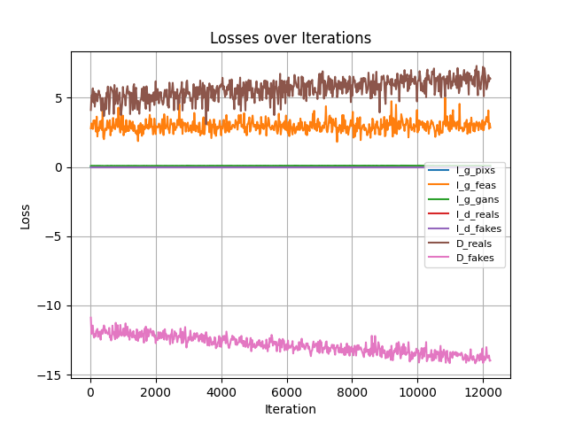

# RealSR

## 1.模型概述

RealSR是针对于真实世界超分辨率的方法，能获得更好的感知，产生更低的噪声以及更好的视觉质量，这里是NTIRE 2020 Track 1的适配。来自于[RealSR](https://github.com/Tencent/Real-SR)，使用DIV2K数据进行训练，训练环境为`realsr`。

## 2.快速开始

### 2.1环境配置

请参考[基础环境安装](https://gitee.com/tecorigin/modelzoo/blob/main/doc/Environment.md)章节，完成训练前的基础环境检查和安装。

```bash
pip install -r requirements.txt
```

### 2.2数据集获取与准备

数据集来自[DIV2K](https://data.vision.ee.ethz.ch/cvl/DIV2K/)，运行以下命令进行数据预处理。

```bash
cd codes
python3 ./preprocess/create_bicubic_dataset.py --dataset df2k --artifacts tdsr
python3 ./preprocess/collect_noise.py --dataset df2k --artifacts tdsr
```

### 2.3模型训练

运行以下命令进行训练。

```bash
cd codes
bash train_track1.sh
```

### 2.4结果展示

训练过程中的loss如下图所示。

