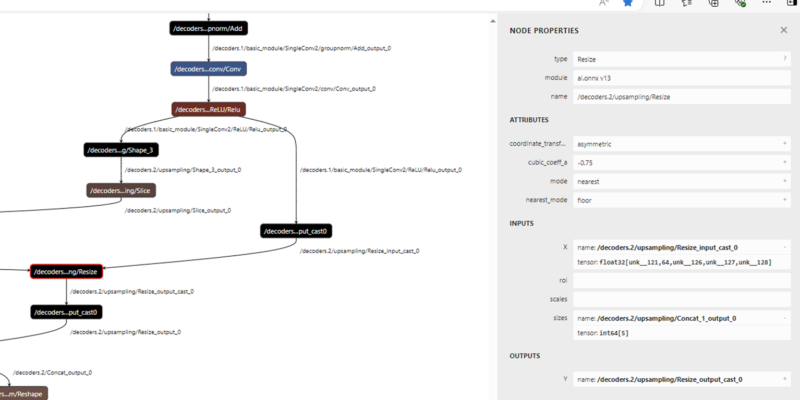

# TecoInferenceEngine（小模型）算子提需模板

# 背景描述

请简要描述算子需求背景，需求来源/项目等信息。

# 需求汇总清单

以表格形式，对您此次提交的所有算子需求进行信息汇总，主要包括需求名称、需求类型（例如：接口缺失、已有算子功能增加等）、算子对应的网络模型、算子需求的验收标准等。表格样式如下：

|  **编号**  |  **需求名称**  |  **需求类型**  |  **对接的网络模型**  |  **需求验收标准**  |  **期望交付时间**  |
| --- | --- | --- | --- | --- | --- |
|  1  |  xxx算子  |  接口缺失  |  xxx模型  |  *   T100卡上支持xxx算子，且算子精度对齐xxx      |  YYYY/MM/DD  |
|  2  |  xxx算子  |  算子功能增强  |  xxx模型  |  *   精度对齐xxx         |  YYYY/MM/DD  |

# 算子详细信息

## 3.1 xxx新算子支持

### 3.1.1 接口说明

*   **针对Pytorch、ONNX Runtime和CuDNN等相关框架已有对应的实现的算子：**
    
    * 请提供算子的官方原始说明文档（链接或者附件）。文档需要能够说明算子已经支持的输入和输出数据 类型、物理布局、参数限制等参数信息。
        
    * 若有其他额外约束，例如：是否需支持原位操作、广播、stride等，请在接口说明中提出。
        

*   **针对Pytorch、ONNX Runtime和CuDNN等相关框架没有对应的实现的算子：**
    建议您优先使用自定义算子接入功能完成算子需求。若需要太初技术团队支持，需要提供以下信息：

    * 详细描述需求接口信息、计算公式，语义和行为。
    * 算子支持的功能范围：需以表格形式，描述输入和输出类型、数据类型、物理布局、参数限制等参数信息。_
    * （可选）算子的官网参考资料，包括文档和相关源码。
    * 若有其他额外约束，例如：是否需支持原位操作、广播、stride等，请在接口说明中提出。
    

### 3.1.2 算子精度基线

*  请提供精度基线标准，即何种框架下的何种设备的计算结果作为基线。例如：以PyTorch框架下CUDA设备的计算结果作为基线、以ONNX Runtime框架下的CPU设备的计算结果作为基线。
*  （如有）请提供精度基线对应框架下的设备代码实现。


### 3.1.3 模型信息

请提供任一形式的模型网络信息：

* 整网Relay IR或者需求算子Kernel 的Relay IR。
* （推荐）整体ONNX模型代码或离线文件。
*  ONNX模型片段，即模型最小可执行片段，可以通过Netron等工具查看该片段。
    

## 3.2 xxx算子功能增强

### 3.2.1 接口说明

请描述算子需要增强的参数/功能等，例如：数据类型支持。具体需要包含以下信息：

* 说明清楚新增参数/功能的语义和行为。
* 若有其他额外约束，例如：是否需支持原位操作、广播、stride等，请在接口说明中提出。
    

### 3.2.2 算子精度对齐基线

* 请提供精度基线标准，即何种框架下的何种设备计算结果作为基线。例如：以PyTorch框架下CUDA设备的计算结果作为基线、以ONNX框架下的CPU设备的计算结果作为基线。
* 请提供精度基线对应框架下的设备代码实现。
    

### 3.2.3 模型信息

请提供任一形式的模型网络信息：

* 提供整网Relay IR或者需求算子Kernel 的Relay IR。
* 提供整体ONNX模型。  
* 提供ONNX模型片段，即模型最小可执行片段，可以通过Netron等工具查看该片段。
    

# 联系方式

请提供您的电子邮箱或者其他联系方式，方便开发人员向您确认一些细节。

# 样例参考

## 背景描述

请简要描述算子需求背景，需求来源/项目等信息。

## 需求汇总清单

|  **编号**  |  **需求名称**  |  **需求类型**  |  **对接的网络模型**  |  **需求验收标准**  |  **期望交付时间**  |
| --- | --- | --- | --- | --- | --- |
|  1  |  CumSum算子  |  接口缺失  |  模型  |  T100卡上支持xxx算子，算子精度对齐CUDA       |  2025/03/15  |
|  2  |  resize3d算子  |  算子功能增强  |  xxx模型  |  支持method="nearest\_neighbor"模式，算子精度对齐CUDA       |  2025/03/15  |

## CumSum新算子

### 接口说明

CumSum官方文档：[CumSum - ONNX 1.18.0 documentation](https://onnx.ai/onnx/operators/onnx__CumSum.html)

### 算子精度基线

* 需要以ONNX Runtime框架的CPU设备的计算结果作为精度对齐基线。
    
* ONNX Runtime CPU设备对应代码：[onnxruntime/onnxruntime/core/providers/cpu/math/cumsum.cc at main · microsoft/onnxruntime · GitHub](https://github.com/microsoft/onnxruntime/blob/main/onnxruntime/core/providers/cpu/math/cumsum.cc)
    

### 模型信息

* 模型的Relay IR片段：
    
  ```plaintext
  %2024 = multiply(%2022, %2023) /* ty=int64 */;
  %2025 = cumsum(%2002, axis=-1) /* ty=Tensor[(?, ?, ?), float16] */;
  ```

* 模型的ONNX片段：


# resize3d算子功能增强

### 接口说明

resize3d新增method="nearest\_neighbor"模式。

### 精度基线标准

* 需要以PyTorch下的CUDA设备的计算结果作为精度基线。
    

### 模型信息

* 模型的Relay IR片段：
    
  ```plaintext
  %123 = layout_transform(%122, src_layout="NDHWC", dst_layout="NCDHW") /* ty=Tensor[(1, 64, 40,   85, 85), float16] */;
  %124 = image.resize3d(%123, size=[80, 170, 170], roi=[0f, 0f, 0f, 0f, 0f, 0f],   method="nearest_neighbor", coordinate_transformation_mode="asymmetric", rounding_method="floor",   cubic_alpha=-0.75f) /* ty=Tensor[(1, 64, 80, 170, 170), float16] */;
  ```

* 模型的ONNX片段：
    


## 联系方式

联系方式：邮箱或电话