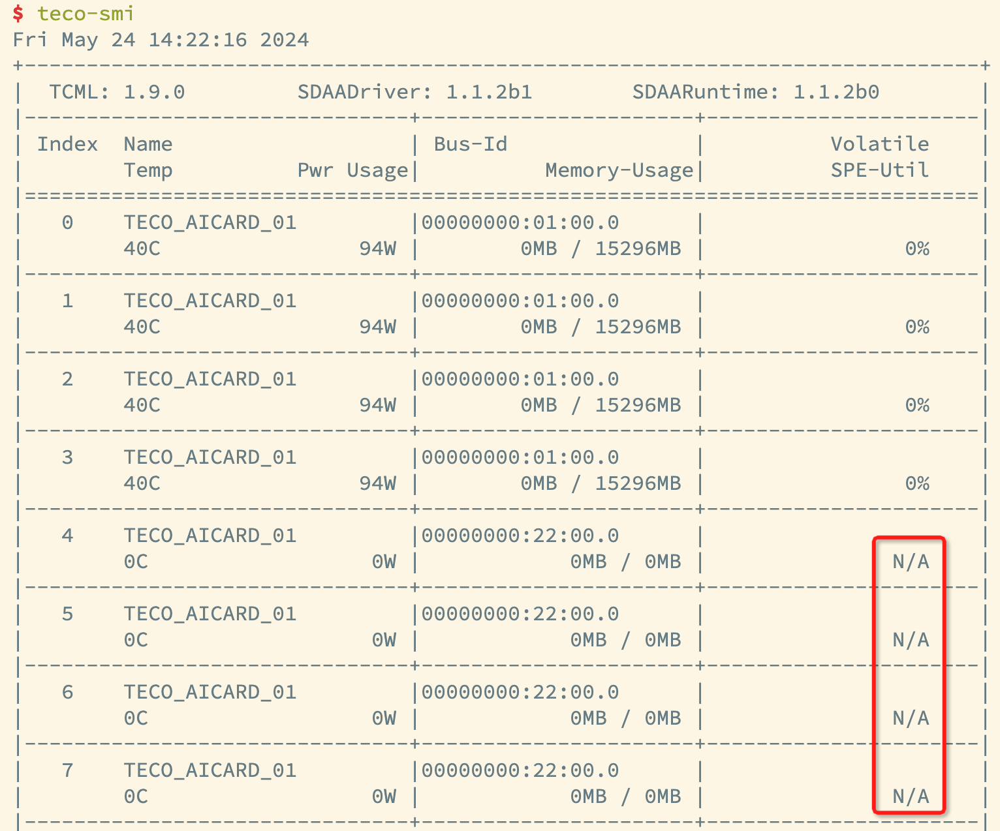

# 常见问题

## 1. 为何更推荐使用AMP的方式运行模型？

针对float16类型的卷积和矩阵乘法的运算，太初芯片针对特有的硬件计算单元，在软件层次进行了深度优化，使用AMP计算可以极大提升性能。

## 2. 为何更推荐卷积使用NHWC的layout进行计算？

T1芯片适合计算NHWC的layout，所以太初卷积算子计算使用的layout是NHWC。

如果卷积使用NCHW输入，则会额外进行几次内存拷贝，转成channel last再进行计算，计算效率相比会降低。

## 3. TecoPyTorch/TecoPaddle上如何使用分布式数据并行（DDP）和自动混合精度（AMP）？

与PyTorch和PaddlePaddle原生框架的分布式数据并行接口上并无本质区别，只是使用起来rank（SPA通信时在通信域中的编号）的数量变多。可以使用`SDAA_VISIBLE_DEVICES`来控制device的数量。

请参考文档中心相关文档，设置DPP及AMP：

* PyTorch：http://docs.tecorigin.com/release/tecopytorch
  
* PaddlePaddle：http://docs.tecorigin.com/release/tecopaddle/  
  
## 4. T1芯片卡内和卡间的device通信效率是一样的吗？

T1芯片卡内device的通信效率远大于卡间device的通信效率，如果有多张卡，可以尝试使用`tcclperftest`命令测试卡内及卡间的通信效率。

* 卡内device通信效率测试：
  ```  
  SDAA_VISIBLE_DEVICES=0,1,2,3 tcclperftest -n 4
  ```
* 卡间device通信效率测试：
  ```
  SDAA_VISIBLE_DEVICES=0,1,4,5 tcclperftest -n 4
  ```

## 5. teco-smi显示的占用的进程PID为什么和ps命令显示的PID不一致？

当前Tecorign ModelZoo提供给用户的是Docker环境，在Docker内部，`teco-smi`显示的进程是宿主机上的进程，`ps`显示的是Docker内部的进程。如果使用`kill`命令，需要输入Docker内部的进程。  


## 6. 使用TecoSMI查看加速卡硬件信息时，Volatile SPE-Util列为N/A，如何处理？

`teco-smi`显示**Volatile SPE-Util**列为N/A时，说明T1芯片出现了掉卡行为。例如：下图第一张卡正常，第二张卡出现掉卡问题。

当出现掉卡问题时，请联系太初工作人员解决。  


## 7. 如何查看Docker中的框架和依赖组件的版本信息？

在Docker中，您可以使用以下命令，查看框架和组件的信息。

- TecoPaddle
  ```
  conda info -e                                # 查看当前conda环境信息
  conda activate torch_env                     # 激活torch-sdaa环境
  pip list|grep torch                          # 查看当前环境下torch-sdaa的简单信息
  python -c "import torch;import torch_sdaa"   # 查看当前环境下torch-sdaa的详细信息
  ```
- TecoPyTorch
  ```
  conda info -e                  # 查看当前conda环境信息
  conda activate paddle_env      # 激活paddle-sdaa环境
  pip list|grep paddle           # 查看当前环境下paddle-sdaa的简单信息
  python -c "import paddle"      # 查看当前环境下paddle-sdaa的详细信息
  ```